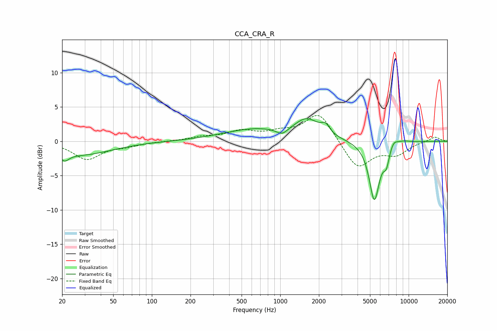

# CCA_CRA_R
See [usage instructions](https://github.com/jaakkopasanen/AutoEq#usage) for more options and info.

### Parametric EQs
Apply preamp of -3.4 dB when using parametric equalizer.

|   # | Type    |   Fc (Hz) |    Q |   Gain (dB) |
|-----|---------|-----------|------|-------------|
|   1 | Peaking |        21 | 4.04 |        -1.2 |
|   2 | Peaking |        28 | 0.59 |        -1.9 |
|   3 | Peaking |       631 | 0.57 |         1.7 |
|   4 | Peaking |      1034 | 3.14 |        -1   |
|   5 | Peaking |      1616 | 1.5  |         2.7 |
|   6 | Peaking |      2250 | 4.17 |         1.2 |
|   7 | Peaking |      5407 | 3.36 |        -8.6 |
|   8 | Peaking |      6707 | 5.92 |        -2.2 |
|   9 | Peaking |      7634 | 4.31 |         1   |
|  10 | Peaking |      9072 | 2.48 |         0.4 |

### Fixed Band EQs
When using fixed band (also called graphic) equalizer, apply preamp of **-3.9 dB** (if available) and set gains manually with these parameters.

|   # | Type    |   Fc (Hz) |    Q |   Gain (dB) |
|-----|---------|-----------|------|-------------|
|   1 | Peaking |        31 | 1.41 |        -2.6 |
|   2 | Peaking |        62 | 1.41 |        -0.6 |
|   3 | Peaking |       125 | 1.41 |        -0   |
|   4 | Peaking |       250 | 1.41 |         0.6 |
|   5 | Peaking |       500 | 1.41 |         1.3 |
|   6 | Peaking |      1000 | 1.41 |         1   |
|   7 | Peaking |      2000 | 1.41 |         4.2 |
|   8 | Peaking |      4000 | 1.41 |        -4.1 |
|   9 | Peaking |      8000 | 1.41 |        -1.7 |
|  10 | Peaking |     16000 | 1.41 |         0.7 |

### Graphs

