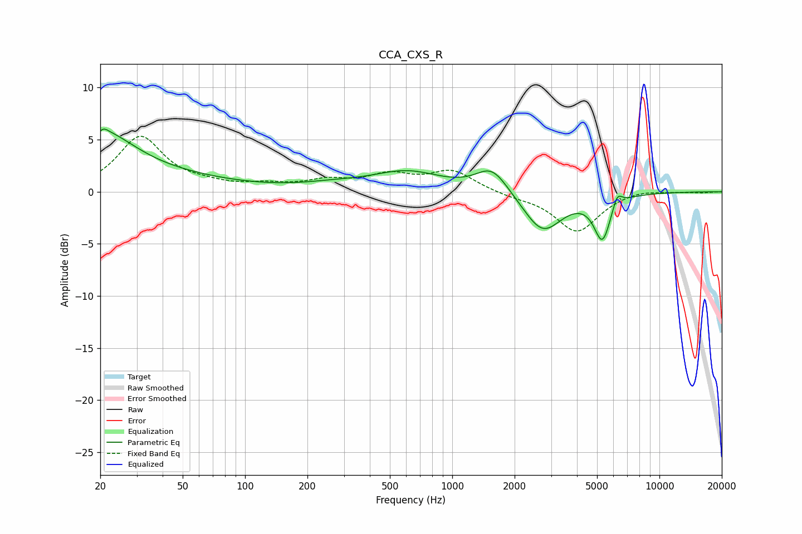

# CCA_CXS_R
See [usage instructions](https://github.com/jaakkopasanen/AutoEq#usage) for more options and info.

### Parametric EQs
Apply preamp of -6.1 dB when using parametric equalizer.

|   # | Type    |   Fc (Hz) |    Q |   Gain (dB) |
|-----|---------|-----------|------|-------------|
|   1 | Peaking |        20 | 0.89 |         4.6 |
|   2 | Peaking |        20 | 5.93 |        -2.8 |
|   3 | Peaking |        20 | 5.91 |         3   |
|   4 | Peaking |        35 | 0.38 |         1.3 |
|   5 | Peaking |       267 | 0.87 |         0.5 |
|   6 | Peaking |       606 | 0.86 |         1.8 |
|   7 | Peaking |      1555 | 1.84 |         2.4 |
|   8 | Peaking |      2731 | 1.52 |        -3.9 |
|   9 | Peaking |      5306 | 3.47 |        -4.3 |
|  10 | Peaking |      6258 | 5.98 |         1.3 |

### Fixed Band EQs
When using fixed band (also called graphic) equalizer, apply preamp of **-5.4 dB** (if available) and set gains manually with these parameters.

|   # | Type    |   Fc (Hz) |    Q |   Gain (dB) |
|-----|---------|-----------|------|-------------|
|   1 | Peaking |        31 | 1.41 |         5.2 |
|   2 | Peaking |        62 | 1.41 |         0.5 |
|   3 | Peaking |       125 | 1.41 |         0.5 |
|   4 | Peaking |       250 | 1.41 |         0.9 |
|   5 | Peaking |       500 | 1.41 |         1.4 |
|   6 | Peaking |      1000 | 1.41 |         1.9 |
|   7 | Peaking |      2000 | 1.41 |        -0.4 |
|   8 | Peaking |      4000 | 1.41 |        -3.8 |
|   9 | Peaking |      8000 | 1.41 |         0.3 |
|  10 | Peaking |     16000 | 1.41 |        -0.1 |

### Graphs

