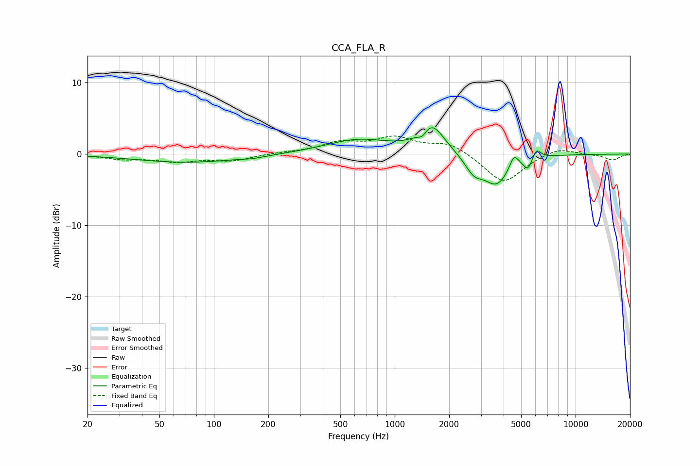

# CCA_FLA_R
See [usage instructions](https://github.com/jaakkopasanen/AutoEq#usage) for more options and info.

### Parametric EQs
Apply preamp of -3.8 dB when using parametric equalizer.

|   # | Type    |   Fc (Hz) |    Q |   Gain (dB) |
|-----|---------|-----------|------|-------------|
|   1 | Peaking |        72 | 0.5  |        -1.2 |
|   2 | Peaking |       164 | 2.22 |        -0.2 |
|   3 | Peaking |       629 | 0.78 |         2   |
|   4 | Peaking |      1423 | 5.99 |        -0.9 |
|   5 | Peaking |      1603 | 2.08 |         3.9 |
|   6 | Peaking |      2740 | 2.86 |        -2.2 |
|   7 | Peaking |      3661 | 1.95 |        -4.1 |
|   8 | Peaking |      4564 | 5.76 |         1.9 |
|   9 | Peaking |      5454 | 6    |        -1.7 |
|  10 | Peaking |      6079 | 6    |         1.5 |

### Fixed Band EQs
When using fixed band (also called graphic) equalizer, apply preamp of **-2.6 dB** (if available) and set gains manually with these parameters.

|   # | Type    |   Fc (Hz) |    Q |   Gain (dB) |
|-----|---------|-----------|------|-------------|
|   1 | Peaking |        31 | 1.41 |        -0.6 |
|   2 | Peaking |        62 | 1.41 |        -0.9 |
|   3 | Peaking |       125 | 1.41 |        -0.9 |
|   4 | Peaking |       250 | 1.41 |         0.2 |
|   5 | Peaking |       500 | 1.41 |         1.5 |
|   6 | Peaking |      1000 | 1.41 |         2.1 |
|   7 | Peaking |      2000 | 1.41 |         1.6 |
|   8 | Peaking |      4000 | 1.41 |        -4.2 |
|   9 | Peaking |      8000 | 1.41 |         1   |
|  10 | Peaking |     16000 | 1.41 |        -0.8 |

### Graphs

