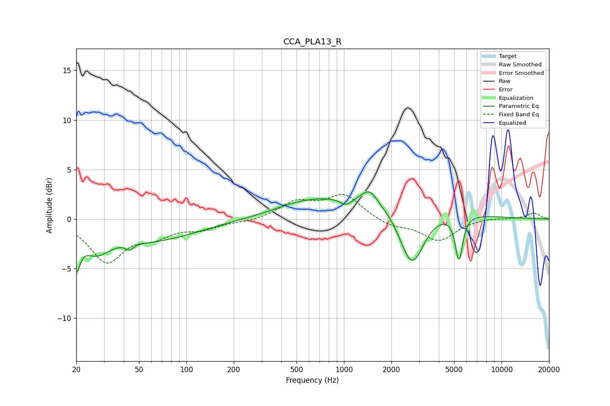

# CCA_PLA13_R
See [usage instructions](https://github.com/jaakkopasanen/AutoEq#usage) for more options and info.

### Parametric EQs
Apply preamp of -2.8 dB when using parametric equalizer.

|   # | Type    |   Fc (Hz) |    Q |   Gain (dB) |
|-----|---------|-----------|------|-------------|
|   1 | Peaking |        20 | 5.94 |        -3.3 |
|   2 | Peaking |        27 | 1.61 |        -2.3 |
|   3 | Peaking |        44 | 5.9  |        -0.6 |
|   4 | Peaking |        60 | 0.49 |        -2.1 |
|   5 | Peaking |       519 | 0.87 |         0.7 |
|   6 | Peaking |      1032 | 3.41 |        -0.8 |
|   7 | Peaking |      1454 | 3.04 |         1.2 |
|   8 | Peaking |      1652 | 0.34 |         2.6 |
|   9 | Peaking |      2695 | 1.73 |        -6.5 |
|  10 | Peaking |      5367 | 5.9  |        -4.5 |

### Fixed Band EQs
When using fixed band (also called graphic) equalizer, apply preamp of **-2.6 dB** (if available) and set gains manually with these parameters.

|   # | Type    |   Fc (Hz) |    Q |   Gain (dB) |
|-----|---------|-----------|------|-------------|
|   1 | Peaking |        31 | 1.41 |        -4.2 |
|   2 | Peaking |        62 | 1.41 |        -1.4 |
|   3 | Peaking |       125 | 1.41 |        -0.9 |
|   4 | Peaking |       250 | 1.41 |        -0.3 |
|   5 | Peaking |       500 | 1.41 |         1.6 |
|   6 | Peaking |      1000 | 1.41 |         2.4 |
|   7 | Peaking |      2000 | 1.41 |        -0.7 |
|   8 | Peaking |      4000 | 1.41 |        -2.2 |
|   9 | Peaking |      8000 | 1.41 |         0.2 |
|  10 | Peaking |     16000 | 1.41 |         0.6 |

### Graphs

