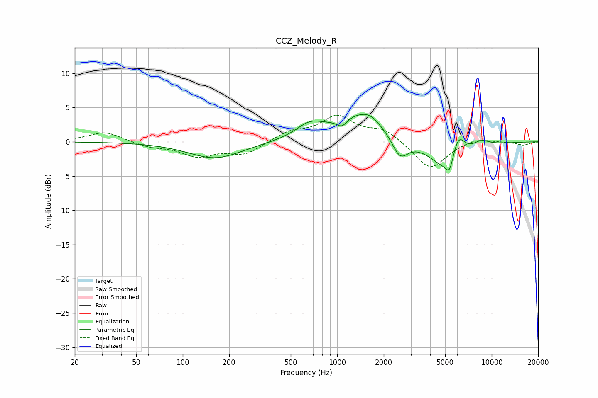

# CCZ_Melody_R
See [usage instructions](https://github.com/jaakkopasanen/AutoEq#usage) for more options and info.

### Parametric EQs
Apply preamp of -4.1 dB when using parametric equalizer.

|   # | Type    |   Fc (Hz) |    Q |   Gain (dB) |
|-----|---------|-----------|------|-------------|
|   1 | Peaking |       162 | 0.82 |        -2.4 |
|   2 | Peaking |       661 | 1.61 |         1.9 |
|   3 | Peaking |      1074 | 4.07 |        -1.3 |
|   4 | Peaking |      1404 | 0.84 |         4   |
|   5 | Peaking |      1636 | 2.5  |         0.7 |
|   6 | Peaking |      2548 | 2.71 |        -3.1 |
|   7 | Peaking |      5288 | 1.23 |        -4.9 |
|   8 | Peaking |      5337 | 6    |        -2   |
|   9 | Peaking |      6060 | 2.94 |         4.4 |
|  10 | Peaking |      8478 | 2.24 |         1.1 |

### Fixed Band EQs
When using fixed band (also called graphic) equalizer, apply preamp of **-4.0 dB** (if available) and set gains manually with these parameters.

|   # | Type    |   Fc (Hz) |    Q |   Gain (dB) |
|-----|---------|-----------|------|-------------|
|   1 | Peaking |        31 | 1.41 |         1.5 |
|   2 | Peaking |        62 | 1.41 |        -0.7 |
|   3 | Peaking |       125 | 1.41 |        -2   |
|   4 | Peaking |       250 | 1.41 |        -1.8 |
|   5 | Peaking |       500 | 1.41 |         1.4 |
|   6 | Peaking |      1000 | 1.41 |         3.5 |
|   7 | Peaking |      2000 | 1.41 |         1.7 |
|   8 | Peaking |      4000 | 1.41 |        -4.1 |
|   9 | Peaking |      8000 | 1.41 |         0.7 |
|  10 | Peaking |     16000 | 1.41 |        -0.5 |

### Graphs

