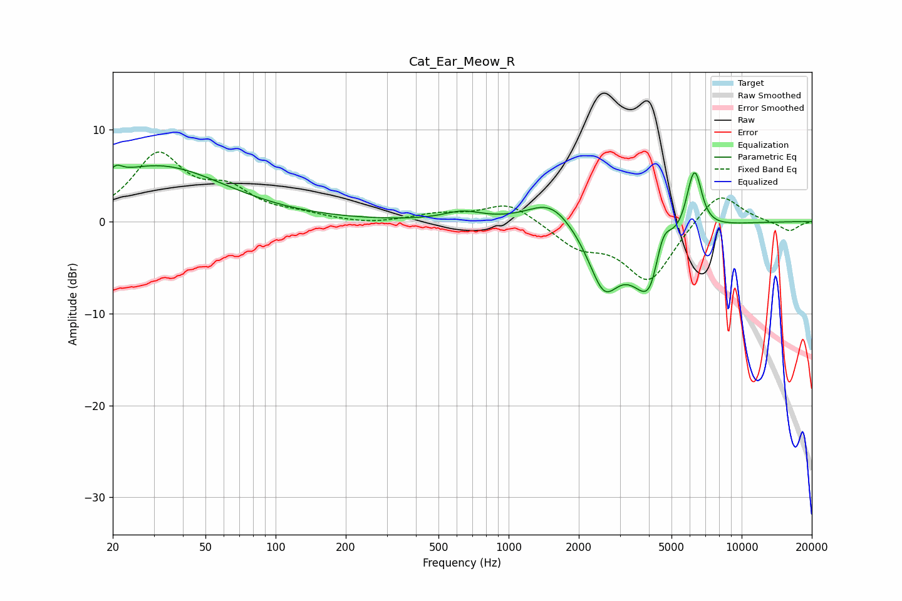

# Cat_Ear_Meow_R
See [usage instructions](https://github.com/jaakkopasanen/AutoEq#usage) for more options and info.

### Parametric EQs
Apply preamp of -6.2 dB when using parametric equalizer.

|   # | Type    |   Fc (Hz) |    Q |   Gain (dB) |
|-----|---------|-----------|------|-------------|
|   1 | Peaking |        21 | 5.37 |         1   |
|   2 | Peaking |        31 | 0.49 |         6   |
|   3 | Peaking |       635 | 1.76 |         1   |
|   4 | Peaking |      1522 | 1.45 |         2.7 |
|   5 | Peaking |      2562 | 2.1  |        -6.4 |
|   6 | Peaking |      3953 | 1.66 |        -6.6 |
|   7 | Peaking |      4083 | 3.87 |        -1.9 |
|   8 | Peaking |      4580 | 3.6  |         4.2 |
|   9 | Peaking |      6114 | 4.52 |         3.5 |
|  10 | Peaking |      6390 | 4.94 |         3.6 |

### Fixed Band EQs
When using fixed band (also called graphic) equalizer, apply preamp of **-7.7 dB** (if available) and set gains manually with these parameters.

|   # | Type    |   Fc (Hz) |    Q |   Gain (dB) |
|-----|---------|-----------|------|-------------|
|   1 | Peaking |        31 | 1.41 |         7   |
|   2 | Peaking |        62 | 1.41 |         2.9 |
|   3 | Peaking |       125 | 1.41 |         0.6 |
|   4 | Peaking |       250 | 1.41 |        -0.3 |
|   5 | Peaking |       500 | 1.41 |         0.7 |
|   6 | Peaking |      1000 | 1.41 |         2.1 |
|   7 | Peaking |      2000 | 1.41 |        -2.5 |
|   8 | Peaking |      4000 | 1.41 |        -6.4 |
|   9 | Peaking |      8000 | 1.41 |         3.6 |
|  10 | Peaking |     16000 | 1.41 |        -1.1 |

### Graphs

