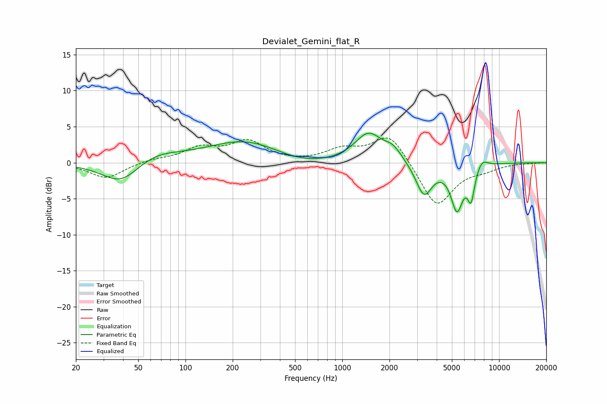

# Devialet_Gemini_flat_R
See [usage instructions](https://github.com/jaakkopasanen/AutoEq#usage) for more options and info.

### Parametric EQs
Apply preamp of -4.2 dB when using parametric equalizer.

|   # | Type    |   Fc (Hz) |    Q |   Gain (dB) |
|-----|---------|-----------|------|-------------|
|   1 | Peaking |        39 | 1.15 |        -3.3 |
|   2 | Peaking |        62 | 0.9  |         1.6 |
|   3 | Peaking |       248 | 0.57 |         3.2 |
|   4 | Peaking |       519 | 0.74 |        -1.2 |
|   5 | Peaking |      1468 | 1.62 |         4   |
|   6 | Peaking |      2109 | 2.51 |         1.5 |
|   7 | Peaking |      3320 | 2.68 |        -4.6 |
|   8 | Peaking |      5388 | 3.55 |        -6.1 |
|   9 | Peaking |      6625 | 6    |        -4.2 |
|  10 | Peaking |      7785 | 3.76 |         1.2 |

### Fixed Band EQs
When using fixed band (also called graphic) equalizer, apply preamp of **-3.5 dB** (if available) and set gains manually with these parameters.

|   # | Type    |   Fc (Hz) |    Q |   Gain (dB) |
|-----|---------|-----------|------|-------------|
|   1 | Peaking |        31 | 1.41 |        -2.2 |
|   2 | Peaking |        62 | 1.41 |         0.4 |
|   3 | Peaking |       125 | 1.41 |         1.9 |
|   4 | Peaking |       250 | 1.41 |         2.8 |
|   5 | Peaking |       500 | 1.41 |        -0   |
|   6 | Peaking |      1000 | 1.41 |         1.7 |
|   7 | Peaking |      2000 | 1.41 |         4.1 |
|   8 | Peaking |      4000 | 1.41 |        -6.3 |
|   9 | Peaking |      8000 | 1.41 |        -0.7 |
|  10 | Peaking |     16000 | 1.41 |        -0   |

### Graphs

