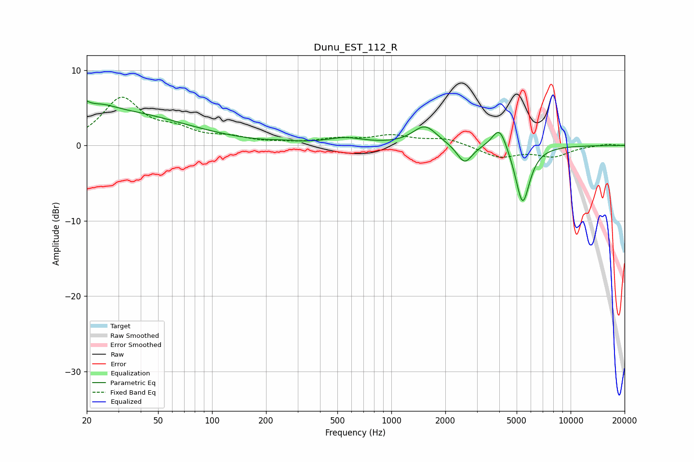

# Dunu_EST_112_R
See [usage instructions](https://github.com/jaakkopasanen/AutoEq#usage) for more options and info.

### Parametric EQs
Apply preamp of -6.0 dB when using parametric equalizer.

|   # | Type    |   Fc (Hz) |    Q |   Gain (dB) |
|-----|---------|-----------|------|-------------|
|   1 | Peaking |        20 | 5.69 |         3.3 |
|   2 | Peaking |        20 | 5.98 |        -2.3 |
|   3 | Peaking |        24 | 2.04 |         0.7 |
|   4 | Peaking |        25 | 0.32 |         4.6 |
|   5 | Peaking |       244 | 2.46 |         0.2 |
|   6 | Peaking |       554 | 1.37 |         0.9 |
|   7 | Peaking |      1539 | 2.11 |         2.6 |
|   8 | Peaking |      2563 | 3.35 |        -2.6 |
|   9 | Peaking |      4013 | 3.4  |         3.2 |
|  10 | Peaking |      5398 | 3.43 |        -7.9 |

### Fixed Band EQs
When using fixed band (also called graphic) equalizer, apply preamp of **-6.5 dB** (if available) and set gains manually with these parameters.

|   # | Type    |   Fc (Hz) |    Q |   Gain (dB) |
|-----|---------|-----------|------|-------------|
|   1 | Peaking |        31 | 1.41 |         6.1 |
|   2 | Peaking |        62 | 1.41 |         1.6 |
|   3 | Peaking |       125 | 1.41 |         0.9 |
|   4 | Peaking |       250 | 1.41 |         0.2 |
|   5 | Peaking |       500 | 1.41 |         0.8 |
|   6 | Peaking |      1000 | 1.41 |         1.2 |
|   7 | Peaking |      2000 | 1.41 |         0.9 |
|   8 | Peaking |      4000 | 1.41 |        -1.5 |
|   9 | Peaking |      8000 | 1.41 |        -1.4 |
|  10 | Peaking |     16000 | 1.41 |         0.2 |

### Graphs

