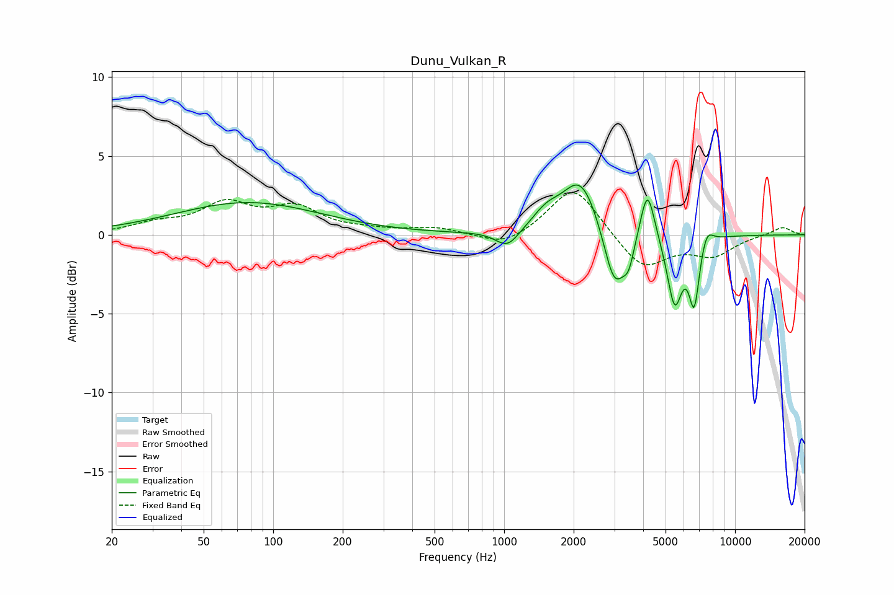

# Dunu_Vulkan_R
See [usage instructions](https://github.com/jaakkopasanen/AutoEq#usage) for more options and info.

### Parametric EQs
Apply preamp of -3.3 dB when using parametric equalizer.

|   # | Type    |   Fc (Hz) |    Q |   Gain (dB) |
|-----|---------|-----------|------|-------------|
|   1 | Peaking |        78 | 0.45 |         2   |
|   2 | Peaking |      1034 | 2.78 |        -1.1 |
|   3 | Peaking |      1525 | 2.28 |         1   |
|   4 | Peaking |      2151 | 1.8  |         3.6 |
|   5 | Peaking |      3005 | 2.97 |        -3.9 |
|   6 | Peaking |      3464 | 5.9  |        -1.4 |
|   7 | Peaking |      4175 | 4.6  |         3.4 |
|   8 | Peaking |      5475 | 4.27 |        -4.3 |
|   9 | Peaking |      6656 | 5.98 |        -4.1 |
|  10 | Peaking |      7522 | 4.97 |         1.1 |

### Fixed Band EQs
When using fixed band (also called graphic) equalizer, apply preamp of **-2.8 dB** (if available) and set gains manually with these parameters.

|   # | Type    |   Fc (Hz) |    Q |   Gain (dB) |
|-----|---------|-----------|------|-------------|
|   1 | Peaking |        31 | 1.41 |         0.6 |
|   2 | Peaking |        62 | 1.41 |         1.8 |
|   3 | Peaking |       125 | 1.41 |         1.6 |
|   4 | Peaking |       250 | 1.41 |         0.2 |
|   5 | Peaking |       500 | 1.41 |         0.4 |
|   6 | Peaking |      1000 | 1.41 |        -0.8 |
|   7 | Peaking |      2000 | 1.41 |         3.2 |
|   8 | Peaking |      4000 | 1.41 |        -2.2 |
|   9 | Peaking |      8000 | 1.41 |        -1.2 |
|  10 | Peaking |     16000 | 1.41 |         0.5 |

### Graphs

