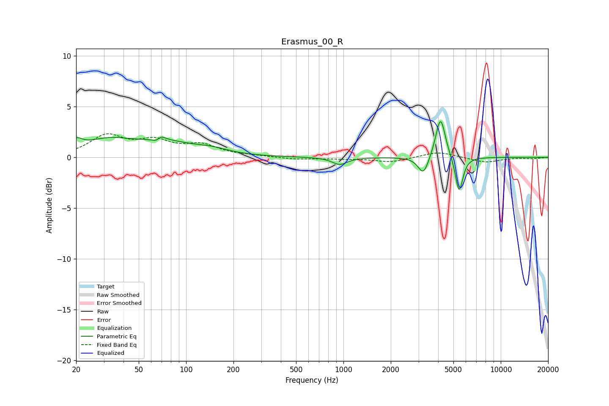

# Erasmus_00_R
See [usage instructions](https://github.com/jaakkopasanen/AutoEq#usage) for more options and info.

### Parametric EQs
Apply preamp of -3.6 dB when using parametric equalizer.

|   # | Type    |   Fc (Hz) |    Q |   Gain (dB) |
|-----|---------|-----------|------|-------------|
|   1 | Peaking |        20 | 3.71 |         0.9 |
|   2 | Peaking |        32 | 0.9  |         1.5 |
|   3 | Peaking |        67 | 5.02 |        -1.6 |
|   4 | Peaking |        68 | 5.03 |         1.7 |
|   5 | Peaking |        73 | 0.8  |         1.2 |
|   6 | Peaking |       145 | 1.25 |         0.5 |
|   7 | Peaking |       948 | 2.96 |        -0.7 |
|   8 | Peaking |      3226 | 4.19 |        -1.9 |
|   9 | Peaking |      4142 | 4.61 |         4.1 |
|  10 | Peaking |      5438 | 5.83 |        -3.6 |

### Fixed Band EQs
When using fixed band (also called graphic) equalizer, apply preamp of **-2.4 dB** (if available) and set gains manually with these parameters.

|   # | Type    |   Fc (Hz) |    Q |   Gain (dB) |
|-----|---------|-----------|------|-------------|
|   1 | Peaking |        31 | 1.41 |         2   |
|   2 | Peaking |        62 | 1.41 |         1.4 |
|   3 | Peaking |       125 | 1.41 |         1.1 |
|   4 | Peaking |       250 | 1.41 |         0.1 |
|   5 | Peaking |       500 | 1.41 |        -0.2 |
|   6 | Peaking |      1000 | 1.41 |        -0.1 |
|   7 | Peaking |      2000 | 1.41 |        -0.5 |
|   8 | Peaking |      4000 | 1.41 |         0.6 |
|   9 | Peaking |      8000 | 1.41 |        -0.5 |
|  10 | Peaking |     16000 | 1.41 |        -0.1 |

### Graphs

