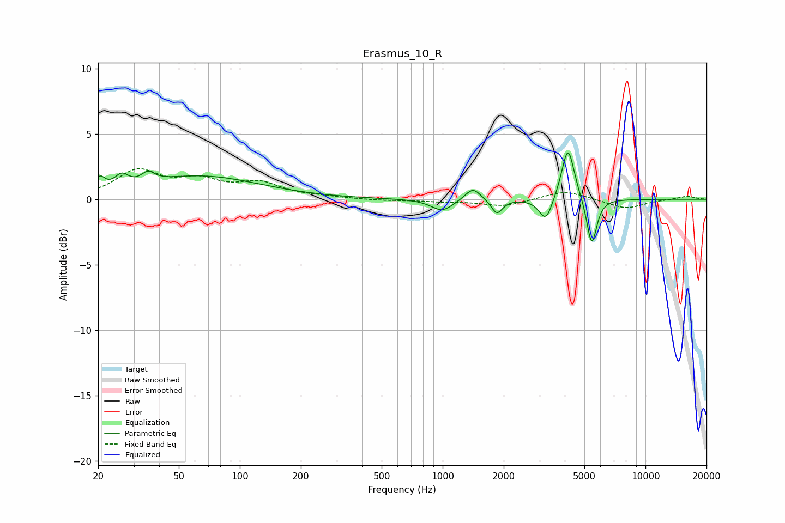

# Erasmus_10_R
See [usage instructions](https://github.com/jaakkopasanen/AutoEq#usage) for more options and info.

### Parametric EQs
Apply preamp of -3.6 dB when using parametric equalizer.

|   # | Type    |   Fc (Hz) |    Q |   Gain (dB) |
|-----|---------|-----------|------|-------------|
|   1 | Peaking |        20 | 5.88 |         1   |
|   2 | Peaking |        26 | 4.32 |         0.9 |
|   3 | Peaking |        35 | 4.46 |         0.7 |
|   4 | Peaking |        64 | 0.49 |         1.8 |
|   5 | Peaking |       994 | 2.64 |        -0.9 |
|   6 | Peaking |      1410 | 3.72 |         1   |
|   7 | Peaking |      1850 | 5.18 |        -1.1 |
|   8 | Peaking |      3228 | 4.34 |        -1.8 |
|   9 | Peaking |      4151 | 4.51 |         4.2 |
|  10 | Peaking |      5434 | 5.77 |        -3.7 |

### Fixed Band EQs
When using fixed band (also called graphic) equalizer, apply preamp of **-2.4 dB** (if available) and set gains manually with these parameters.

|   # | Type    |   Fc (Hz) |    Q |   Gain (dB) |
|-----|---------|-----------|------|-------------|
|   1 | Peaking |        31 | 1.41 |         2.1 |
|   2 | Peaking |        62 | 1.41 |         1.2 |
|   3 | Peaking |       125 | 1.41 |         1.1 |
|   4 | Peaking |       250 | 1.41 |         0.1 |
|   5 | Peaking |       500 | 1.41 |        -0.1 |
|   6 | Peaking |      1000 | 1.41 |        -0.1 |
|   7 | Peaking |      2000 | 1.41 |        -0.5 |
|   8 | Peaking |      4000 | 1.41 |         0.7 |
|   9 | Peaking |      8000 | 1.41 |        -0.7 |
|  10 | Peaking |     16000 | 1.41 |         0.3 |

### Graphs

