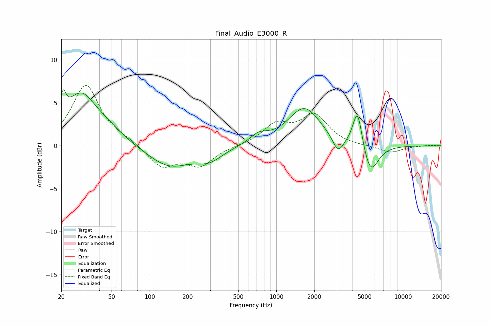

# Final_Audio_E3000_R
See [usage instructions](https://github.com/jaakkopasanen/AutoEq#usage) for more options and info.

### Parametric EQs
Apply preamp of -6.6 dB when using parametric equalizer.

|   # | Type    |   Fc (Hz) |    Q |   Gain (dB) |
|-----|---------|-----------|------|-------------|
|   1 | Peaking |        21 | 5.95 |         2.8 |
|   2 | Peaking |        28 | 1.18 |         5.5 |
|   3 | Peaking |        46 | 1.06 |         1.3 |
|   4 | Peaking |       142 | 0.84 |        -2.4 |
|   5 | Peaking |       296 | 1.36 |        -1.4 |
|   6 | Peaking |       728 | 2.01 |         1   |
|   7 | Peaking |      1668 | 1.11 |         4.4 |
|   8 | Peaking |      3078 | 3.28 |        -1.9 |
|   9 | Peaking |      4381 | 3.78 |         4.6 |
|  10 | Peaking |      5537 | 2.26 |        -3.6 |

### Fixed Band EQs
When using fixed band (also called graphic) equalizer, apply preamp of **-7.1 dB** (if available) and set gains manually with these parameters.

|   # | Type    |   Fc (Hz) |    Q |   Gain (dB) |
|-----|---------|-----------|------|-------------|
|   1 | Peaking |        31 | 1.41 |         7   |
|   2 | Peaking |        62 | 1.41 |         0.5 |
|   3 | Peaking |       125 | 1.41 |        -2.4 |
|   4 | Peaking |       250 | 1.41 |        -2.2 |
|   5 | Peaking |       500 | 1.41 |        -0   |
|   6 | Peaking |      1000 | 1.41 |         2.3 |
|   7 | Peaking |      2000 | 1.41 |         3.4 |
|   8 | Peaking |      4000 | 1.41 |        -0.1 |
|   9 | Peaking |      8000 | 1.41 |        -0.8 |
|  10 | Peaking |     16000 | 1.41 |         0.1 |

### Graphs

