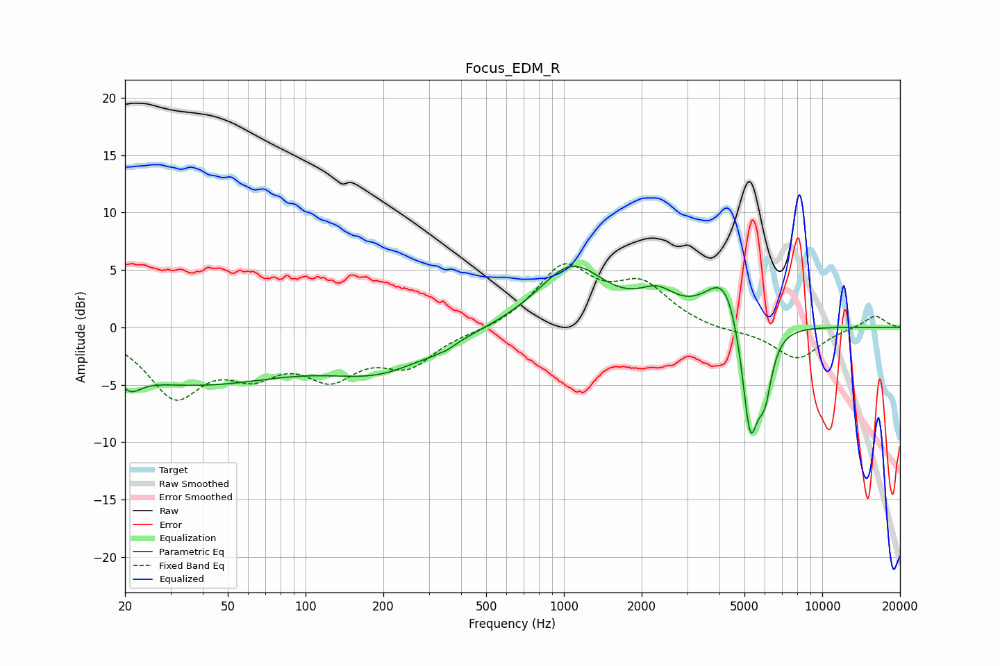

# Focus_EDM_R
See [usage instructions](https://github.com/jaakkopasanen/AutoEq#usage) for more options and info.

### Parametric EQs
Apply preamp of -5.4 dB when using parametric equalizer.

|   # | Type    |   Fc (Hz) |    Q |   Gain (dB) |
|-----|---------|-----------|------|-------------|
|   1 | Peaking |        21 | 3.39 |        -1.4 |
|   2 | Peaking |        36 | 0.35 |        -4.7 |
|   3 | Peaking |       196 | 0.69 |        -3.1 |
|   4 | Peaking |       332 | 4.71 |         3.6 |
|   5 | Peaking |       332 | 4.4  |        -4   |
|   6 | Peaking |      1072 | 1.08 |         5.4 |
|   7 | Peaking |      2298 | 1.97 |         2   |
|   8 | Peaking |      4234 | 1.9  |         5   |
|   9 | Peaking |      5260 | 4.06 |       -10.8 |
|  10 | Peaking |      5995 | 4.98 |        -4.3 |

### Fixed Band EQs
When using fixed band (also called graphic) equalizer, apply preamp of **-5.6 dB** (if available) and set gains manually with these parameters.

|   # | Type    |   Fc (Hz) |    Q |   Gain (dB) |
|-----|---------|-----------|------|-------------|
|   1 | Peaking |        31 | 1.41 |        -5.6 |
|   2 | Peaking |        62 | 1.41 |        -3.1 |
|   3 | Peaking |       125 | 1.41 |        -3.7 |
|   4 | Peaking |       250 | 1.41 |        -3   |
|   5 | Peaking |       500 | 1.41 |        -0.3 |
|   6 | Peaking |      1000 | 1.41 |         5.1 |
|   7 | Peaking |      2000 | 1.41 |         3.4 |
|   8 | Peaking |      4000 | 1.41 |        -0.4 |
|   9 | Peaking |      8000 | 1.41 |        -2.8 |
|  10 | Peaking |     16000 | 1.41 |         1.1 |

### Graphs

