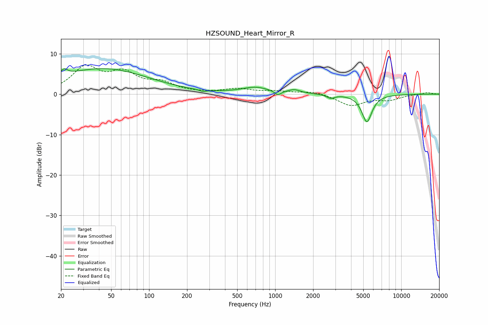

# HZSOUND_Heart_Mirror_R
See [usage instructions](https://github.com/jaakkopasanen/AutoEq#usage) for more options and info.

### Parametric EQs
Apply preamp of -6.4 dB when using parametric equalizer.

|   # | Type    |   Fc (Hz) |    Q |   Gain (dB) |
|-----|---------|-----------|------|-------------|
|   1 | Peaking |        21 | 5.68 |         1.5 |
|   2 | Peaking |        21 | 0.24 |         1.4 |
|   3 | Peaking |        45 | 0.4  |         5.1 |
|   4 | Peaking |       267 | 5.02 |        -0.5 |
|   5 | Peaking |       619 | 1.89 |        -0   |
|   6 | Peaking |       695 | 1.3  |         1.6 |
|   7 | Peaking |      1050 | 5.66 |        -1.1 |
|   8 | Peaking |      1419 | 2.9  |         0.9 |
|   9 | Peaking |      2760 | 4.67 |        -0.9 |
|  10 | Peaking |      5339 | 3.48 |        -6.8 |

### Fixed Band EQs
When using fixed band (also called graphic) equalizer, apply preamp of **-7.3 dB** (if available) and set gains manually with these parameters.

|   # | Type    |   Fc (Hz) |    Q |   Gain (dB) |
|-----|---------|-----------|------|-------------|
|   1 | Peaking |        31 | 1.41 |         6.3 |
|   2 | Peaking |        62 | 1.41 |         4.5 |
|   3 | Peaking |       125 | 1.41 |         2.4 |
|   4 | Peaking |       250 | 1.41 |         0.1 |
|   5 | Peaking |       500 | 1.41 |         1.2 |
|   6 | Peaking |      1000 | 1.41 |         0.6 |
|   7 | Peaking |      2000 | 1.41 |         0.7 |
|   8 | Peaking |      4000 | 1.41 |        -2.8 |
|   9 | Peaking |      8000 | 1.41 |        -1.3 |
|  10 | Peaking |     16000 | 1.41 |         0.4 |

### Graphs

