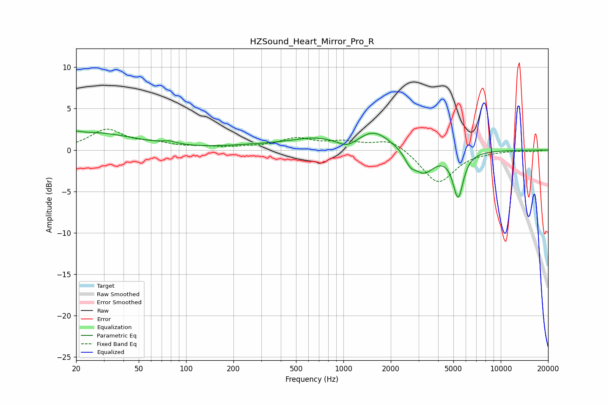

# HZSound_Heart_Mirror_Pro_R
See [usage instructions](https://github.com/jaakkopasanen/AutoEq#usage) for more options and info.

### Parametric EQs
Apply preamp of -2.4 dB when using parametric equalizer.

|   # | Type    |   Fc (Hz) |    Q |   Gain (dB) |
|-----|---------|-----------|------|-------------|
|   1 | Peaking |        20 | 5.81 |         0.3 |
|   2 | Peaking |        25 | 0.5  |         2.1 |
|   3 | Peaking |        78 | 3.26 |         0.3 |
|   4 | Peaking |       278 | 0.67 |         0.4 |
|   5 | Peaking |       666 | 0.84 |         1.2 |
|   6 | Peaking |      1062 | 2.25 |        -1   |
|   7 | Peaking |      1569 | 1.34 |         2.2 |
|   8 | Peaking |      2656 | 4.52 |        -1.1 |
|   9 | Peaking |      3234 | 2.07 |        -2.8 |
|  10 | Peaking |      5360 | 4.23 |        -5.4 |

### Fixed Band EQs
When using fixed band (also called graphic) equalizer, apply preamp of **-2.6 dB** (if available) and set gains manually with these parameters.

|   # | Type    |   Fc (Hz) |    Q |   Gain (dB) |
|-----|---------|-----------|------|-------------|
|   1 | Peaking |        31 | 1.41 |         2.4 |
|   2 | Peaking |        62 | 1.41 |         0.7 |
|   3 | Peaking |       125 | 1.41 |         0.3 |
|   4 | Peaking |       250 | 1.41 |         0.2 |
|   5 | Peaking |       500 | 1.41 |         1.3 |
|   6 | Peaking |      1000 | 1.41 |         0.8 |
|   7 | Peaking |      2000 | 1.41 |         1.4 |
|   8 | Peaking |      4000 | 1.41 |        -4.1 |
|   9 | Peaking |      8000 | 1.41 |        -0.1 |
|  10 | Peaking |     16000 | 1.41 |        -0.2 |

### Graphs

