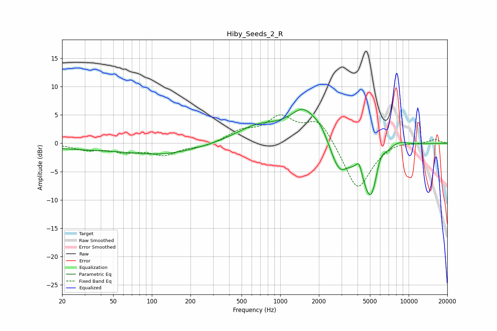

# Hiby_Seeds_2_R
See [usage instructions](https://github.com/jaakkopasanen/AutoEq#usage) for more options and info.

### Parametric EQs
Apply preamp of -6.1 dB when using parametric equalizer.

|   # | Type    |   Fc (Hz) |    Q |   Gain (dB) |
|-----|---------|-----------|------|-------------|
|   1 | Peaking |        66 | 0.18 |        -1.2 |
|   2 | Peaking |       122 | 0.66 |        -0.9 |
|   3 | Peaking |       673 | 0.77 |         3   |
|   4 | Peaking |      1529 | 1.29 |         5.4 |
|   5 | Peaking |      2070 | 2.54 |         1.4 |
|   6 | Peaking |      2873 | 2.11 |        -4.7 |
|   7 | Peaking |      4113 | 5.8  |         2.4 |
|   8 | Peaking |      5102 | 1.86 |       -11.3 |
|   9 | Peaking |      5976 | 3.01 |         3.8 |
|  10 | Peaking |      8069 | 1.57 |         1.6 |

### Fixed Band EQs
When using fixed band (also called graphic) equalizer, apply preamp of **-5.1 dB** (if available) and set gains manually with these parameters.

|   # | Type    |   Fc (Hz) |    Q |   Gain (dB) |
|-----|---------|-----------|------|-------------|
|   1 | Peaking |        31 | 1.41 |        -1.1 |
|   2 | Peaking |        62 | 1.41 |        -1.3 |
|   3 | Peaking |       125 | 1.41 |        -1.9 |
|   4 | Peaking |       250 | 1.41 |        -0.6 |
|   5 | Peaking |       500 | 1.41 |         1.9 |
|   6 | Peaking |      1000 | 1.41 |         4.2 |
|   7 | Peaking |      2000 | 1.41 |         4.3 |
|   8 | Peaking |      4000 | 1.41 |        -8.5 |
|   9 | Peaking |      8000 | 1.41 |         0.5 |
|  10 | Peaking |     16000 | 1.41 |         0.7 |

### Graphs

