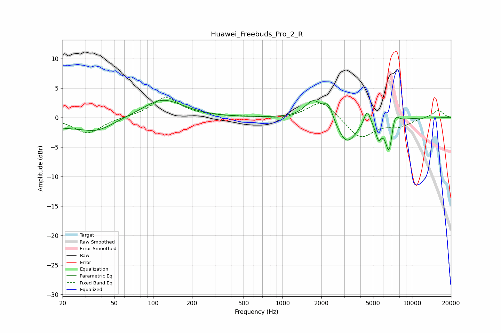

# Huawei_Freebuds_Pro_2_R
See [usage instructions](https://github.com/jaakkopasanen/AutoEq#usage) for more options and info.

### Parametric EQs
Apply preamp of -3.0 dB when using parametric equalizer.

|   # | Type    |   Fc (Hz) |    Q |   Gain (dB) |
|-----|---------|-----------|------|-------------|
|   1 | Peaking |        20 | 0.43 |        -1.6 |
|   2 | Peaking |        38 | 1.25 |        -1.3 |
|   3 | Peaking |       118 | 0.9  |         3.2 |
|   4 | Peaking |      1731 | 2.24 |         3.1 |
|   5 | Peaking |      2264 | 4    |         2.6 |
|   6 | Peaking |      3135 | 1.86 |        -4.5 |
|   7 | Peaking |      4509 | 5.75 |         2.7 |
|   8 | Peaking |      5519 | 6    |        -2.8 |
|   9 | Peaking |      6657 | 4.96 |        -5.8 |
|  10 | Peaking |      7376 | 5    |         2.3 |

### Fixed Band EQs
When using fixed band (also called graphic) equalizer, apply preamp of **-3.5 dB** (if available) and set gains manually with these parameters.

|   # | Type    |   Fc (Hz) |    Q |   Gain (dB) |
|-----|---------|-----------|------|-------------|
|   1 | Peaking |        31 | 1.41 |        -2.7 |
|   2 | Peaking |        62 | 1.41 |         0.1 |
|   3 | Peaking |       125 | 1.41 |         3.4 |
|   4 | Peaking |       250 | 1.41 |         0.2 |
|   5 | Peaking |       500 | 1.41 |         0.1 |
|   6 | Peaking |      1000 | 1.41 |        -0.3 |
|   7 | Peaking |      2000 | 1.41 |         3   |
|   8 | Peaking |      4000 | 1.41 |        -3.6 |
|   9 | Peaking |      8000 | 1.41 |        -1.3 |
|  10 | Peaking |     16000 | 1.41 |         1.3 |

### Graphs

