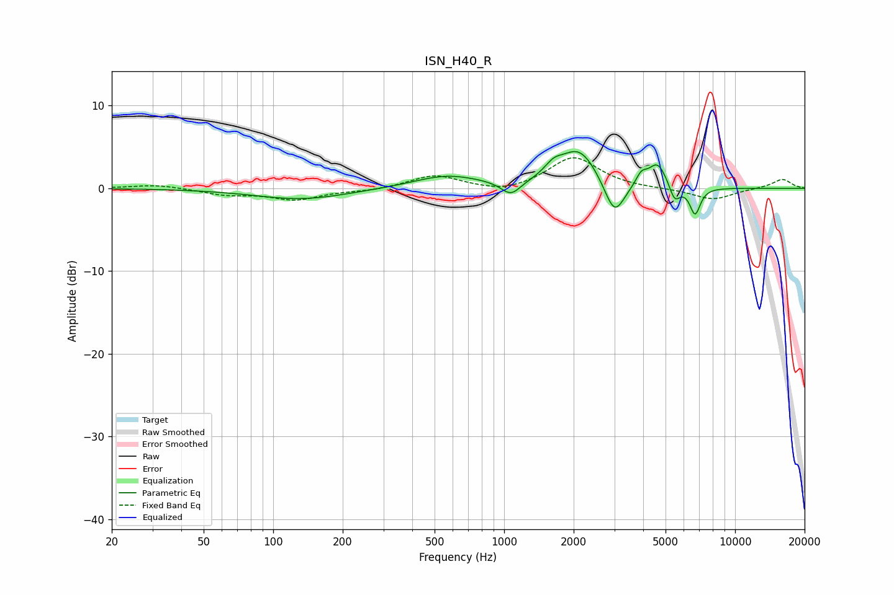

# ISN_H40_R
See [usage instructions](https://github.com/jaakkopasanen/AutoEq#usage) for more options and info.

### Parametric EQs
Apply preamp of -4.5 dB when using parametric equalizer.

|   # | Type    |   Fc (Hz) |    Q |   Gain (dB) |
|-----|---------|-----------|------|-------------|
|   1 | Peaking |       132 | 0.7  |        -1.3 |
|   2 | Peaking |       564 | 0.97 |         1.5 |
|   3 | Peaking |      1070 | 3.35 |        -1.7 |
|   4 | Peaking |      1636 | 3.48 |         1.3 |
|   5 | Peaking |      2111 | 1.73 |         4.6 |
|   6 | Peaking |      3006 | 3.2  |        -4.4 |
|   7 | Peaking |      3926 | 6    |         1.3 |
|   8 | Peaking |      4618 | 3.49 |         3   |
|   9 | Peaking |      5474 | 6    |        -2.1 |
|  10 | Peaking |      6711 | 6    |        -3.3 |

### Fixed Band EQs
When using fixed band (also called graphic) equalizer, apply preamp of **-3.8 dB** (if available) and set gains manually with these parameters.

|   # | Type    |   Fc (Hz) |    Q |   Gain (dB) |
|-----|---------|-----------|------|-------------|
|   1 | Peaking |        31 | 1.41 |         0.5 |
|   2 | Peaking |        62 | 1.41 |        -0.7 |
|   3 | Peaking |       125 | 1.41 |        -1.3 |
|   4 | Peaking |       250 | 1.41 |        -0.3 |
|   5 | Peaking |       500 | 1.41 |         1.6 |
|   6 | Peaking |      1000 | 1.41 |        -0.7 |
|   7 | Peaking |      2000 | 1.41 |         3.8 |
|   8 | Peaking |      4000 | 1.41 |        -0.1 |
|   9 | Peaking |      8000 | 1.41 |        -1.4 |
|  10 | Peaking |     16000 | 1.41 |         1.1 |

### Graphs

