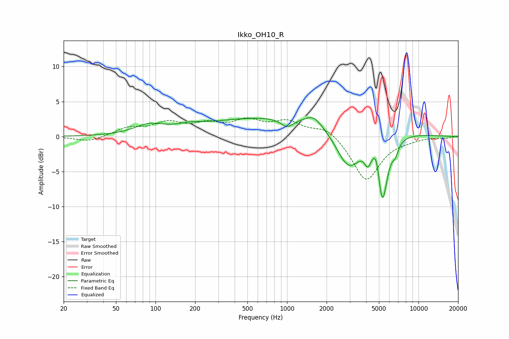

# Ikko_OH10_R
See [usage instructions](https://github.com/jaakkopasanen/AutoEq#usage) for more options and info.

### Parametric EQs
Apply preamp of -2.8 dB when using parametric equalizer.

|   # | Type    |   Fc (Hz) |    Q |   Gain (dB) |
|-----|---------|-----------|------|-------------|
|   1 | Peaking |        89 | 1.25 |         1.3 |
|   2 | Peaking |       185 | 1.52 |         0.5 |
|   3 | Peaking |      1001 | 2.91 |        -1.3 |
|   4 | Peaking |      1162 | 0.18 |         3   |
|   5 | Peaking |      1595 | 2.36 |         1.3 |
|   6 | Peaking |      2937 | 1.43 |        -6.2 |
|   7 | Peaking |      4108 | 5.99 |        -1.9 |
|   8 | Peaking |      4795 | 5.21 |         2.9 |
|   9 | Peaking |      5302 | 3.45 |       -10   |
|  10 | Peaking |      6675 | 6    |        -1.4 |

### Fixed Band EQs
When using fixed band (also called graphic) equalizer, apply preamp of **-2.8 dB** (if available) and set gains manually with these parameters.

|   # | Type    |   Fc (Hz) |    Q |   Gain (dB) |
|-----|---------|-----------|------|-------------|
|   1 | Peaking |        31 | 1.41 |        -0.8 |
|   2 | Peaking |        62 | 1.41 |         1.1 |
|   3 | Peaking |       125 | 1.41 |         1.8 |
|   4 | Peaking |       250 | 1.41 |         1.5 |
|   5 | Peaking |       500 | 1.41 |         2   |
|   6 | Peaking |      1000 | 1.41 |         1.9 |
|   7 | Peaking |      2000 | 1.41 |         1.5 |
|   8 | Peaking |      4000 | 1.41 |        -6.4 |
|   9 | Peaking |      8000 | 1.41 |        -0.3 |
|  10 | Peaking |     16000 | 1.41 |        -0.2 |

### Graphs

