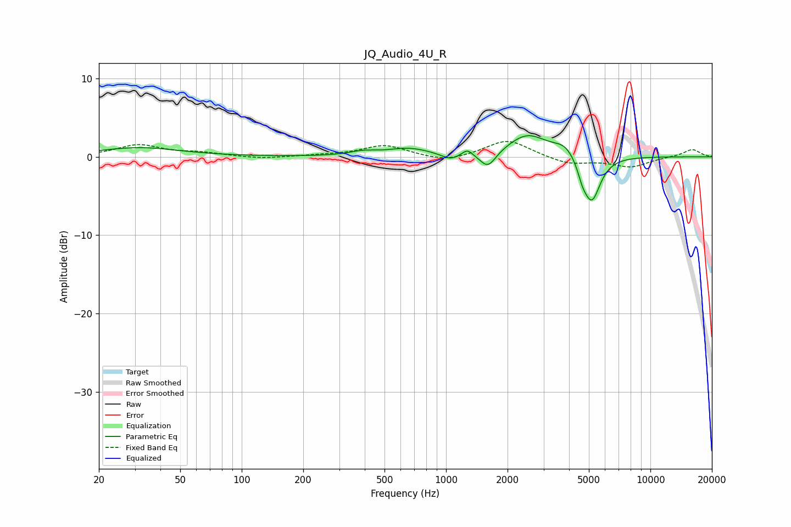

# JQ_Audio_4U_R
See [usage instructions](https://github.com/jaakkopasanen/AutoEq#usage) for more options and info.

### Parametric EQs
Apply preamp of -2.8 dB when using parametric equalizer.

|   # | Type    |   Fc (Hz) |    Q |   Gain (dB) |
|-----|---------|-----------|------|-------------|
|   1 | Peaking |        32 | 0.72 |         1.2 |
|   2 | Peaking |       391 | 2.23 |         0.5 |
|   3 | Peaking |       656 | 1.33 |         1   |
|   4 | Peaking |      1050 | 3.22 |        -0.8 |
|   5 | Peaking |      1272 | 5.62 |         0.9 |
|   6 | Peaking |      1603 | 3.61 |        -2.1 |
|   7 | Peaking |      2503 | 1.48 |         2.8 |
|   8 | Peaking |      3842 | 2.52 |         1.5 |
|   9 | Peaking |      4650 | 6    |        -1.4 |
|  10 | Peaking |      5163 | 3.29 |        -5.8 |

### Fixed Band EQs
When using fixed band (also called graphic) equalizer, apply preamp of **-2.0 dB** (if available) and set gains manually with these parameters.

|   # | Type    |   Fc (Hz) |    Q |   Gain (dB) |
|-----|---------|-----------|------|-------------|
|   1 | Peaking |        31 | 1.41 |         1.5 |
|   2 | Peaking |        62 | 1.41 |         0.4 |
|   3 | Peaking |       125 | 1.41 |        -0.3 |
|   4 | Peaking |       250 | 1.41 |         0.1 |
|   5 | Peaking |       500 | 1.41 |         1.5 |
|   6 | Peaking |      1000 | 1.41 |        -0.8 |
|   7 | Peaking |      2000 | 1.41 |         2.2 |
|   8 | Peaking |      4000 | 1.41 |        -1   |
|   9 | Peaking |      8000 | 1.41 |        -1.3 |
|  10 | Peaking |     16000 | 1.41 |         1   |

### Graphs

