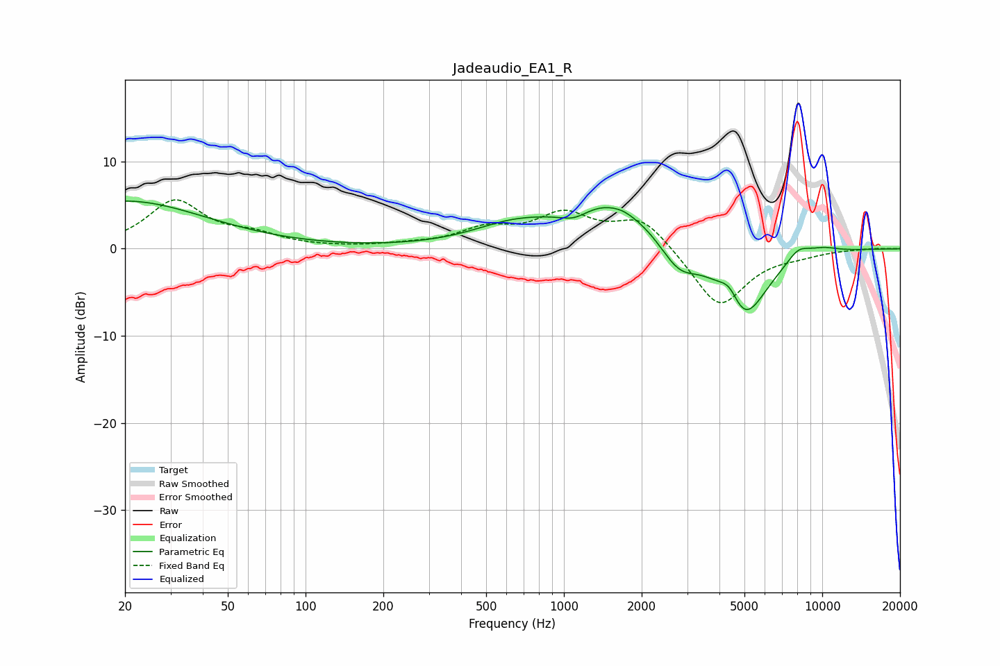

# Jadeaudio_EA1_R
See [usage instructions](https://github.com/jaakkopasanen/AutoEq#usage) for more options and info.

### Parametric EQs
Apply preamp of -5.6 dB when using parametric equalizer.

|   # | Type    |   Fc (Hz) |    Q |   Gain (dB) |
|-----|---------|-----------|------|-------------|
|   1 | Peaking |        20 | 0.45 |         5.5 |
|   2 | Peaking |       626 | 0.9  |         1.9 |
|   3 | Peaking |      1095 | 2.46 |        -1.2 |
|   4 | Peaking |      1525 | 0.76 |         5.4 |
|   5 | Peaking |      1686 | 5.64 |         0.1 |
|   6 | Peaking |      2778 | 1.89 |        -3.3 |
|   7 | Peaking |      4383 | 3.52 |         2.3 |
|   8 | Peaking |      4946 | 1.5  |        -8.6 |
|   9 | Peaking |      8075 | 2.95 |         1.4 |
|  10 | Peaking |     10000 | 1.93 |         0.7 |

### Fixed Band EQs
When using fixed band (also called graphic) equalizer, apply preamp of **-5.7 dB** (if available) and set gains manually with these parameters.

|   # | Type    |   Fc (Hz) |    Q |   Gain (dB) |
|-----|---------|-----------|------|-------------|
|   1 | Peaking |        31 | 1.41 |         5.4 |
|   2 | Peaking |        62 | 1.41 |         1.3 |
|   3 | Peaking |       125 | 1.41 |         0   |
|   4 | Peaking |       250 | 1.41 |         0.3 |
|   5 | Peaking |       500 | 1.41 |         2   |
|   6 | Peaking |      1000 | 1.41 |         3.6 |
|   7 | Peaking |      2000 | 1.41 |         3.6 |
|   8 | Peaking |      4000 | 1.41 |        -6.9 |
|   9 | Peaking |      8000 | 1.41 |        -0.5 |
|  10 | Peaking |     16000 | 1.41 |         0.1 |

### Graphs

