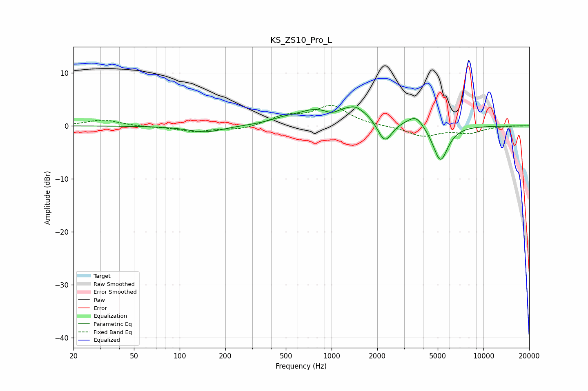

# KS_ZS10_Pro_L
See [usage instructions](https://github.com/jaakkopasanen/AutoEq#usage) for more options and info.

### Parametric EQs
Apply preamp of -3.7 dB when using parametric equalizer.

|   # | Type    |   Fc (Hz) |    Q |   Gain (dB) |
|-----|---------|-----------|------|-------------|
|   1 | Peaking |       148 | 1.21 |        -1.2 |
|   2 | Peaking |       483 | 1.65 |         0.6 |
|   3 | Peaking |       752 | 1.36 |         1.4 |
|   4 | Peaking |      1008 | 2.86 |        -1.1 |
|   5 | Peaking |      1398 | 0.7  |         3.6 |
|   6 | Peaking |      1428 | 3.57 |         0.5 |
|   7 | Peaking |      2060 | 2.36 |        -0.5 |
|   8 | Peaking |      2247 | 2.85 |        -4.6 |
|   9 | Peaking |      3594 | 2.83 |         2   |
|  10 | Peaking |      5206 | 2.79 |        -7   |

### Fixed Band EQs
When using fixed band (also called graphic) equalizer, apply preamp of **-4.0 dB** (if available) and set gains manually with these parameters.

|   # | Type    |   Fc (Hz) |    Q |   Gain (dB) |
|-----|---------|-----------|------|-------------|
|   1 | Peaking |        31 | 1.41 |         1.2 |
|   2 | Peaking |        62 | 1.41 |        -0.2 |
|   3 | Peaking |       125 | 1.41 |        -1   |
|   4 | Peaking |       250 | 1.41 |        -0.7 |
|   5 | Peaking |       500 | 1.41 |         1.7 |
|   6 | Peaking |      1000 | 1.41 |         3.7 |
|   7 | Peaking |      2000 | 1.41 |        -0   |
|   8 | Peaking |      4000 | 1.41 |        -1.9 |
|   9 | Peaking |      8000 | 1.41 |        -1.2 |
|  10 | Peaking |     16000 | 1.41 |         0   |

### Graphs

