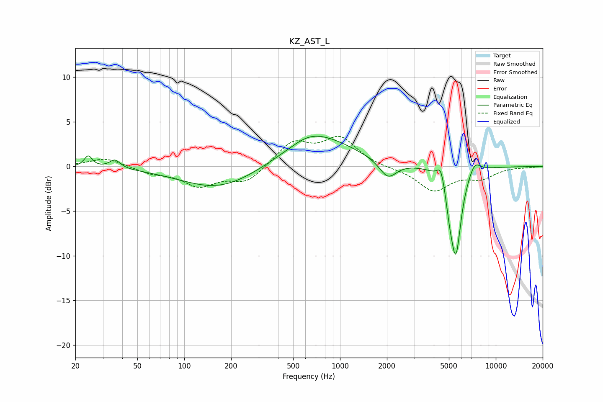

# KZ_AST_L
See [usage instructions](https://github.com/jaakkopasanen/AutoEq#usage) for more options and info.

### Parametric EQs
Apply preamp of -3.5 dB when using parametric equalizer.

|   # | Type    |   Fc (Hz) |    Q |   Gain (dB) |
|-----|---------|-----------|------|-------------|
|   1 | Peaking |        24 | 5.61 |         1.3 |
|   2 | Peaking |        36 | 4.12 |         1   |
|   3 | Peaking |       167 | 0.58 |        -2.5 |
|   4 | Peaking |       622 | 1.5  |         0.5 |
|   5 | Peaking |       726 | 0.63 |         3.4 |
|   6 | Peaking |      2029 | 2.58 |        -2   |
|   7 | Peaking |      4439 | 6    |         1.8 |
|   8 | Peaking |      5047 | 6    |        -1.9 |
|   9 | Peaking |      5539 | 4.04 |        -9.6 |
|  10 | Peaking |      7309 | 3.67 |         1.4 |

### Fixed Band EQs
When using fixed band (also called graphic) equalizer, apply preamp of **-3.5 dB** (if available) and set gains manually with these parameters.

|   # | Type    |   Fc (Hz) |    Q |   Gain (dB) |
|-----|---------|-----------|------|-------------|
|   1 | Peaking |        31 | 1.41 |         1   |
|   2 | Peaking |        62 | 1.41 |        -0.7 |
|   3 | Peaking |       125 | 1.41 |        -2   |
|   4 | Peaking |       250 | 1.41 |        -1.8 |
|   5 | Peaking |       500 | 1.41 |         2.7 |
|   6 | Peaking |      1000 | 1.41 |         3.1 |
|   7 | Peaking |      2000 | 1.41 |        -0.2 |
|   8 | Peaking |      4000 | 1.41 |        -2.7 |
|   9 | Peaking |      8000 | 1.41 |        -1.2 |
|  10 | Peaking |     16000 | 1.41 |        -0.1 |

### Graphs

