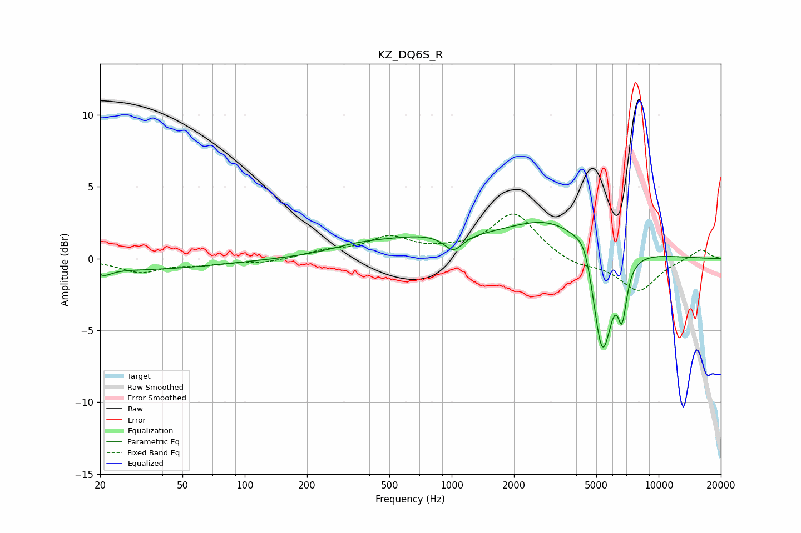

# KZ_DQ6S_R
See [usage instructions](https://github.com/jaakkopasanen/AutoEq#usage) for more options and info.

### Parametric EQs
Apply preamp of -2.6 dB when using parametric equalizer.

|   # | Type    |   Fc (Hz) |    Q |   Gain (dB) |
|-----|---------|-----------|------|-------------|
|   1 | Peaking |        21 | 3.93 |        -0.4 |
|   2 | Peaking |        29 | 0.36 |        -0.8 |
|   3 | Peaking |       352 | 1.01 |         0.4 |
|   4 | Peaking |       717 | 0.58 |         1.2 |
|   5 | Peaking |      1020 | 3.17 |        -1.1 |
|   6 | Peaking |      3197 | 0.58 |         2.8 |
|   7 | Peaking |      4417 | 3.46 |         1.4 |
|   8 | Peaking |      5340 | 2.83 |        -8.4 |
|   9 | Peaking |      6425 | 4.91 |         0.9 |
|  10 | Peaking |      6644 | 6    |        -4   |

### Fixed Band EQs
When using fixed band (also called graphic) equalizer, apply preamp of **-3.2 dB** (if available) and set gains manually with these parameters.

|   # | Type    |   Fc (Hz) |    Q |   Gain (dB) |
|-----|---------|-----------|------|-------------|
|   1 | Peaking |        31 | 1.41 |        -0.9 |
|   2 | Peaking |        62 | 1.41 |        -0.3 |
|   3 | Peaking |       125 | 1.41 |        -0.3 |
|   4 | Peaking |       250 | 1.41 |         0.5 |
|   5 | Peaking |       500 | 1.41 |         1.4 |
|   6 | Peaking |      1000 | 1.41 |         0.3 |
|   7 | Peaking |      2000 | 1.41 |         3.1 |
|   8 | Peaking |      4000 | 1.41 |        -0.5 |
|   9 | Peaking |      8000 | 1.41 |        -2.3 |
|  10 | Peaking |     16000 | 1.41 |         0.7 |

### Graphs

