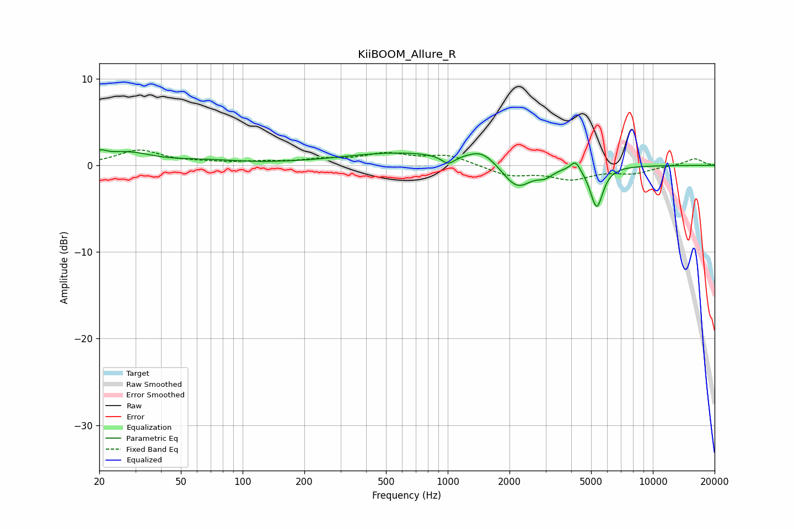

# KiiBOOM_Allure_R
See [usage instructions](https://github.com/jaakkopasanen/AutoEq#usage) for more options and info.

### Parametric EQs
Apply preamp of -1.9 dB when using parametric equalizer.

|   # | Type    |   Fc (Hz) |    Q |   Gain (dB) |
|-----|---------|-----------|------|-------------|
|   1 | Peaking |        20 | 4.56 |         0.8 |
|   2 | Peaking |        27 | 1.17 |         1.4 |
|   3 | Peaking |        66 | 0.92 |         0.4 |
|   4 | Peaking |       593 | 0.48 |         1.4 |
|   5 | Peaking |      1005 | 4.4  |        -1   |
|   6 | Peaking |      1470 | 2.09 |         1.4 |
|   7 | Peaking |      2179 | 2.02 |        -2.9 |
|   8 | Peaking |      2984 | 3.87 |        -0.8 |
|   9 | Peaking |      4192 | 5.96 |         1.2 |
|  10 | Peaking |      5323 | 4.55 |        -4.8 |

### Fixed Band EQs
When using fixed band (also called graphic) equalizer, apply preamp of **-1.9 dB** (if available) and set gains manually with these parameters.

|   # | Type    |   Fc (Hz) |    Q |   Gain (dB) |
|-----|---------|-----------|------|-------------|
|   1 | Peaking |        31 | 1.41 |         1.7 |
|   2 | Peaking |        62 | 1.41 |         0.2 |
|   3 | Peaking |       125 | 1.41 |         0.3 |
|   4 | Peaking |       250 | 1.41 |         0.6 |
|   5 | Peaking |       500 | 1.41 |         1.2 |
|   6 | Peaking |      1000 | 1.41 |         1.1 |
|   7 | Peaking |      2000 | 1.41 |        -1.1 |
|   8 | Peaking |      4000 | 1.41 |        -1.4 |
|   9 | Peaking |      8000 | 1.41 |        -0.8 |
|  10 | Peaking |     16000 | 1.41 |         0.8 |

### Graphs

