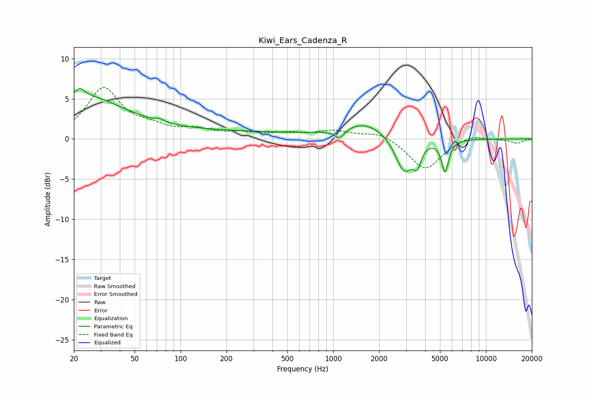

# Kiwi_Ears_Cadenza_R
See [usage instructions](https://github.com/jaakkopasanen/AutoEq#usage) for more options and info.

### Parametric EQs
Apply preamp of -6.4 dB when using parametric equalizer.

|   # | Type    |   Fc (Hz) |    Q |   Gain (dB) |
|-----|---------|-----------|------|-------------|
|   1 | Peaking |        22 | 0.53 |         5   |
|   2 | Peaking |        22 | 5.58 |         0.9 |
|   3 | Peaking |        73 | 6    |         0.3 |
|   4 | Peaking |       135 | 0.18 |         0.9 |
|   5 | Peaking |      1098 | 4.52 |        -1.1 |
|   6 | Peaking |      1612 | 1.03 |         1.9 |
|   7 | Peaking |      2858 | 5.94 |         0.3 |
|   8 | Peaking |      2898 | 2.72 |        -4.6 |
|   9 | Peaking |      3544 | 5.51 |        -2.3 |
|  10 | Peaking |      5403 | 6    |        -3.9 |

### Fixed Band EQs
When using fixed band (also called graphic) equalizer, apply preamp of **-6.5 dB** (if available) and set gains manually with these parameters.

|   # | Type    |   Fc (Hz) |    Q |   Gain (dB) |
|-----|---------|-----------|------|-------------|
|   1 | Peaking |        31 | 1.41 |         6.2 |
|   2 | Peaking |        62 | 1.41 |         1.1 |
|   3 | Peaking |       125 | 1.41 |         1   |
|   4 | Peaking |       250 | 1.41 |         0.6 |
|   5 | Peaking |       500 | 1.41 |         0.6 |
|   6 | Peaking |      1000 | 1.41 |         0.9 |
|   7 | Peaking |      2000 | 1.41 |         0.9 |
|   8 | Peaking |      4000 | 1.41 |        -3.9 |
|   9 | Peaking |      8000 | 1.41 |         0.6 |
|  10 | Peaking |     16000 | 1.41 |        -0.5 |

### Graphs

