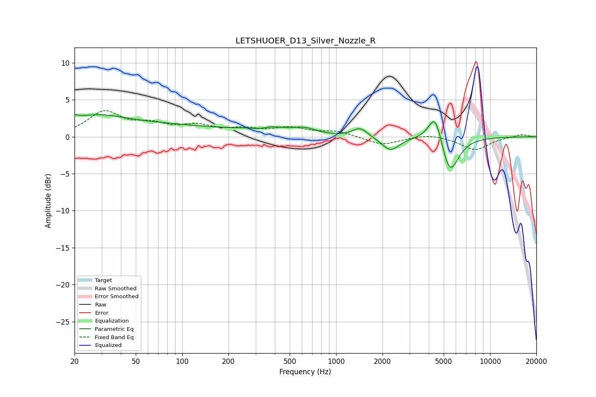

# LETSHUOER_D13_Silver_Nozzle_R
See [usage instructions](https://github.com/jaakkopasanen/AutoEq#usage) for more options and info.

### Parametric EQs
Apply preamp of -3.1 dB when using parametric equalizer.

|   # | Type    |   Fc (Hz) |    Q |   Gain (dB) |
|-----|---------|-----------|------|-------------|
|   1 | Peaking |        20 | 5.7  |         0.5 |
|   2 | Peaking |        26 | 0.69 |         2.3 |
|   3 | Peaking |        82 | 0.37 |         1.3 |
|   4 | Peaking |       318 | 2.17 |        -0.8 |
|   5 | Peaking |       342 | 1.25 |         1.4 |
|   6 | Peaking |       625 | 1.91 |         0.8 |
|   7 | Peaking |      1433 | 3.01 |         1.2 |
|   8 | Peaking |      2260 | 2.53 |        -1.9 |
|   9 | Peaking |      4407 | 3.16 |         4.3 |
|  10 | Peaking |      5469 | 2.44 |        -5.3 |

### Fixed Band EQs
When using fixed band (also called graphic) equalizer, apply preamp of **-3.6 dB** (if available) and set gains manually with these parameters.

|   # | Type    |   Fc (Hz) |    Q |   Gain (dB) |
|-----|---------|-----------|------|-------------|
|   1 | Peaking |        31 | 1.41 |         3.2 |
|   2 | Peaking |        62 | 1.41 |         1.4 |
|   3 | Peaking |       125 | 1.41 |         1.3 |
|   4 | Peaking |       250 | 1.41 |         0.8 |
|   5 | Peaking |       500 | 1.41 |         1.1 |
|   6 | Peaking |      1000 | 1.41 |         0.7 |
|   7 | Peaking |      2000 | 1.41 |        -1.1 |
|   8 | Peaking |      4000 | 1.41 |         0.4 |
|   9 | Peaking |      8000 | 1.41 |        -1.8 |
|  10 | Peaking |     16000 | 1.41 |         0.4 |

### Graphs

