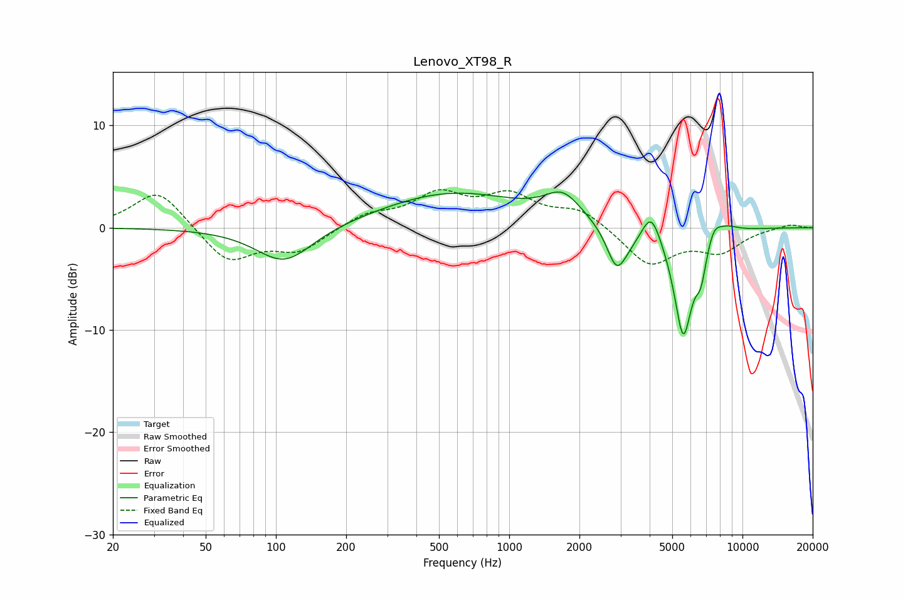

# Lenovo_XT98_R
See [usage instructions](https://github.com/jaakkopasanen/AutoEq#usage) for more options and info.

### Parametric EQs
Apply preamp of -3.6 dB when using parametric equalizer.

|   # | Type    |   Fc (Hz) |    Q |   Gain (dB) |
|-----|---------|-----------|------|-------------|
|   1 | Peaking |       109 | 1.17 |        -3.6 |
|   2 | Peaking |       570 | 0.46 |         3.4 |
|   3 | Peaking |      1700 | 1.83 |         2.5 |
|   4 | Peaking |      2879 | 3.46 |        -3.6 |
|   5 | Peaking |      3189 | 2.17 |        -1.3 |
|   6 | Peaking |      4064 | 3.53 |         3   |
|   7 | Peaking |      5574 | 3.38 |       -10.6 |
|   8 | Peaking |      6638 | 6    |        -2.8 |
|   9 | Peaking |      7537 | 4.46 |         1.4 |
|  10 | Peaking |      8541 | 2.6  |         0.7 |

### Fixed Band EQs
When using fixed band (also called graphic) equalizer, apply preamp of **-3.8 dB** (if available) and set gains manually with these parameters.

|   # | Type    |   Fc (Hz) |    Q |   Gain (dB) |
|-----|---------|-----------|------|-------------|
|   1 | Peaking |        31 | 1.41 |         3.8 |
|   2 | Peaking |        62 | 1.41 |        -3.4 |
|   3 | Peaking |       125 | 1.41 |        -2.2 |
|   4 | Peaking |       250 | 1.41 |         1.3 |
|   5 | Peaking |       500 | 1.41 |         3   |
|   6 | Peaking |      1000 | 1.41 |         2.8 |
|   7 | Peaking |      2000 | 1.41 |         1.7 |
|   8 | Peaking |      4000 | 1.41 |        -3.6 |
|   9 | Peaking |      8000 | 1.41 |        -2.2 |
|  10 | Peaking |     16000 | 1.41 |         0.4 |

### Graphs

