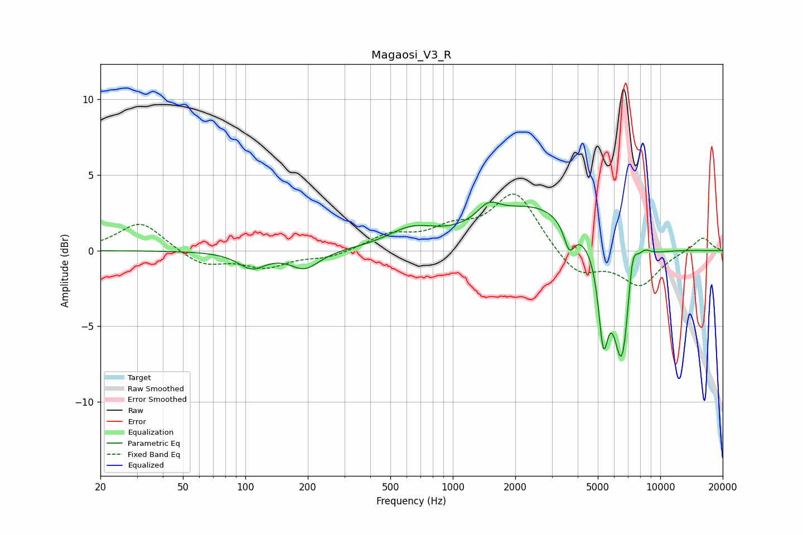

# Magaosi_V3_R
See [usage instructions](https://github.com/jaakkopasanen/AutoEq#usage) for more options and info.

### Parametric EQs
Apply preamp of -3.3 dB when using parametric equalizer.

|   # | Type    |   Fc (Hz) |    Q |   Gain (dB) |
|-----|---------|-----------|------|-------------|
|   1 | Peaking |       107 | 2.13 |        -1.1 |
|   2 | Peaking |       193 | 2    |        -1.2 |
|   3 | Peaking |       632 | 1.24 |         1.2 |
|   4 | Peaking |      1486 | 2.64 |         1.1 |
|   5 | Peaking |      2519 | 0.61 |         2.9 |
|   6 | Peaking |      3645 | 5.46 |        -1.7 |
|   7 | Peaking |      5316 | 6    |        -5.3 |
|   8 | Peaking |      6554 | 3.13 |        -8.4 |
|   9 | Peaking |      7328 | 5.27 |         3.2 |
|  10 | Peaking |      8352 | 3.83 |         0.8 |

### Fixed Band EQs
When using fixed band (also called graphic) equalizer, apply preamp of **-3.8 dB** (if available) and set gains manually with these parameters.

|   # | Type    |   Fc (Hz) |    Q |   Gain (dB) |
|-----|---------|-----------|------|-------------|
|   1 | Peaking |        31 | 1.41 |         1.9 |
|   2 | Peaking |        62 | 1.41 |        -1   |
|   3 | Peaking |       125 | 1.41 |        -1   |
|   4 | Peaking |       250 | 1.41 |        -0.5 |
|   5 | Peaking |       500 | 1.41 |         1   |
|   6 | Peaking |      1000 | 1.41 |         1.2 |
|   7 | Peaking |      2000 | 1.41 |         3.8 |
|   8 | Peaking |      4000 | 1.41 |        -1.7 |
|   9 | Peaking |      8000 | 1.41 |        -2.2 |
|  10 | Peaking |     16000 | 1.41 |         0.9 |

### Graphs

