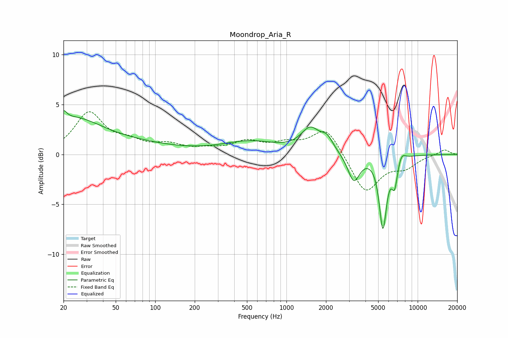

# Moondrop_Aria_R
See [usage instructions](https://github.com/jaakkopasanen/AutoEq#usage) for more options and info.

### Parametric EQs
Apply preamp of -4.5 dB when using parametric equalizer.

|   # | Type    |   Fc (Hz) |    Q |   Gain (dB) |
|-----|---------|-----------|------|-------------|
|   1 | Peaking |        20 | 5.99 |         0.9 |
|   2 | Peaking |        23 | 0.69 |         2.5 |
|   3 | Peaking |        39 | 0.29 |         1.2 |
|   4 | Peaking |       527 | 0.67 |         1.2 |
|   5 | Peaking |      1517 | 2    |         2.3 |
|   6 | Peaking |      2039 | 3.04 |         1.2 |
|   7 | Peaking |      3258 | 3.12 |        -2.7 |
|   8 | Peaking |      5431 | 4.96 |        -7.1 |
|   9 | Peaking |      6667 | 5.98 |        -2.6 |
|  10 | Peaking |      7522 | 4.76 |         0.9 |

### Fixed Band EQs
When using fixed band (also called graphic) equalizer, apply preamp of **-4.4 dB** (if available) and set gains manually with these parameters.

|   # | Type    |   Fc (Hz) |    Q |   Gain (dB) |
|-----|---------|-----------|------|-------------|
|   1 | Peaking |        31 | 1.41 |         4.1 |
|   2 | Peaking |        62 | 1.41 |         1   |
|   3 | Peaking |       125 | 1.41 |         0.8 |
|   4 | Peaking |       250 | 1.41 |         0.4 |
|   5 | Peaking |       500 | 1.41 |         1.2 |
|   6 | Peaking |      1000 | 1.41 |         0.9 |
|   7 | Peaking |      2000 | 1.41 |         2.7 |
|   8 | Peaking |      4000 | 1.41 |        -3.9 |
|   9 | Peaking |      8000 | 1.41 |        -1.1 |
|  10 | Peaking |     16000 | 1.41 |         0.5 |

### Graphs

