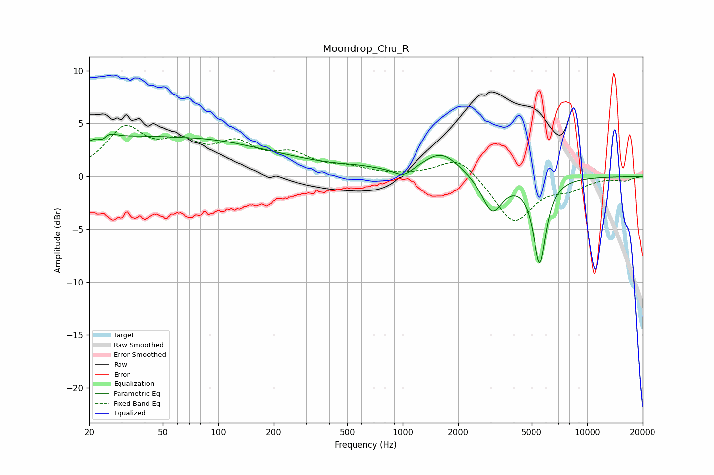

# Moondrop_Chu_R
See [usage instructions](https://github.com/jaakkopasanen/AutoEq#usage) for more options and info.

### Parametric EQs
Apply preamp of -4.1 dB when using parametric equalizer.

|   # | Type    |   Fc (Hz) |    Q |   Gain (dB) |
|-----|---------|-----------|------|-------------|
|   1 | Peaking |        24 | 4.61 |        -3.3 |
|   2 | Peaking |        24 | 3.76 |         3.6 |
|   3 | Peaking |        41 | 0.3  |         3.6 |
|   4 | Peaking |        58 | 1.06 |        -0.2 |
|   5 | Peaking |       187 | 0.4  |         1.1 |
|   6 | Peaking |       590 | 1.27 |         0.3 |
|   7 | Peaking |      1010 | 2.91 |        -0.8 |
|   8 | Peaking |      1621 | 1.45 |         2.2 |
|   9 | Peaking |      3062 | 2.55 |        -3.4 |
|  10 | Peaking |      5542 | 3.97 |        -8   |

### Fixed Band EQs
When using fixed band (also called graphic) equalizer, apply preamp of **-4.9 dB** (if available) and set gains manually with these parameters.

|   # | Type    |   Fc (Hz) |    Q |   Gain (dB) |
|-----|---------|-----------|------|-------------|
|   1 | Peaking |        31 | 1.41 |         4.2 |
|   2 | Peaking |        62 | 1.41 |         2.5 |
|   3 | Peaking |       125 | 1.41 |         2.6 |
|   4 | Peaking |       250 | 1.41 |         1.7 |
|   5 | Peaking |       500 | 1.41 |         0.7 |
|   6 | Peaking |      1000 | 1.41 |         0   |
|   7 | Peaking |      2000 | 1.41 |         2   |
|   8 | Peaking |      4000 | 1.41 |        -4.4 |
|   9 | Peaking |      8000 | 1.41 |        -0.9 |
|  10 | Peaking |     16000 | 1.41 |        -0.4 |

### Graphs

