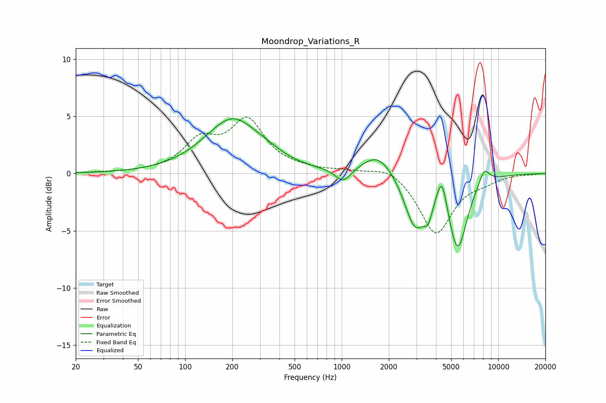

# Moondrop_Variations_R
See [usage instructions](https://github.com/jaakkopasanen/AutoEq#usage) for more options and info.

### Parametric EQs
Apply preamp of -4.9 dB when using parametric equalizer.

|   # | Type    |   Fc (Hz) |    Q |   Gain (dB) |
|-----|---------|-----------|------|-------------|
|   1 | Peaking |       171 | 1.5  |        -0.3 |
|   2 | Peaking |       196 | 0.85 |         4.9 |
|   3 | Peaking |       334 | 1.34 |         0.4 |
|   4 | Peaking |      1021 | 2.83 |        -1.2 |
|   5 | Peaking |      1709 | 1.4  |         1.9 |
|   6 | Peaking |      2938 | 2.1  |        -4.5 |
|   7 | Peaking |      3566 | 4.92 |        -1.6 |
|   8 | Peaking |      4362 | 4.32 |         2.8 |
|   9 | Peaking |      5498 | 2.3  |        -6.5 |
|  10 | Peaking |      8128 | 3.93 |         1.4 |

### Fixed Band EQs
When using fixed band (also called graphic) equalizer, apply preamp of **-5.0 dB** (if available) and set gains manually with these parameters.

|   # | Type    |   Fc (Hz) |    Q |   Gain (dB) |
|-----|---------|-----------|------|-------------|
|   1 | Peaking |        31 | 1.41 |         0.1 |
|   2 | Peaking |        62 | 1.41 |         0.1 |
|   3 | Peaking |       125 | 1.41 |         2.6 |
|   4 | Peaking |       250 | 1.41 |         4.4 |
|   5 | Peaking |       500 | 1.41 |         0.3 |
|   6 | Peaking |      1000 | 1.41 |         0.2 |
|   7 | Peaking |      2000 | 1.41 |         0.8 |
|   8 | Peaking |      4000 | 1.41 |        -5.3 |
|   9 | Peaking |      8000 | 1.41 |        -0.5 |
|  10 | Peaking |     16000 | 1.41 |        -0   |

### Graphs

