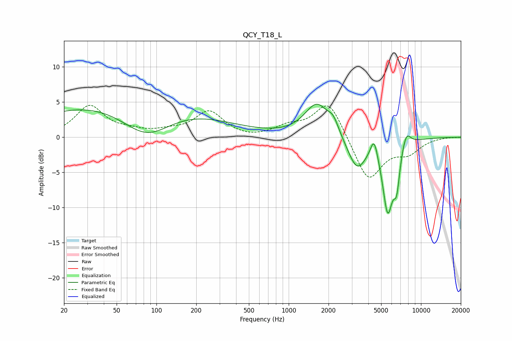

# QCY_T18_L
See [usage instructions](https://github.com/jaakkopasanen/AutoEq#usage) for more options and info.

### Parametric EQs
Apply preamp of -4.8 dB when using parametric equalizer.

|   # | Type    |   Fc (Hz) |    Q |   Gain (dB) |
|-----|---------|-----------|------|-------------|
|   1 | Peaking |        62 | 0.19 |         5.4 |
|   2 | Peaking |        84 | 0.75 |        -4.6 |
|   3 | Peaking |      1634 | 1.52 |         4.7 |
|   4 | Peaking |      2176 | 3.5  |         1.7 |
|   5 | Peaking |      3280 | 1.96 |        -4.6 |
|   6 | Peaking |      4424 | 5.11 |         3   |
|   7 | Peaking |      5014 | 1.82 |         0.6 |
|   8 | Peaking |      5603 | 3.26 |       -10.5 |
|   9 | Peaking |      6549 | 5.94 |        -4.5 |
|  10 | Peaking |      7737 | 4.02 |         2.2 |

### Fixed Band EQs
When using fixed band (also called graphic) equalizer, apply preamp of **-4.6 dB** (if available) and set gains manually with these parameters.

|   # | Type    |   Fc (Hz) |    Q |   Gain (dB) |
|-----|---------|-----------|------|-------------|
|   1 | Peaking |        31 | 1.41 |         4.4 |
|   2 | Peaking |        62 | 1.41 |         0.6 |
|   3 | Peaking |       125 | 1.41 |         0.6 |
|   4 | Peaking |       250 | 1.41 |         3.6 |
|   5 | Peaking |       500 | 1.41 |        -0.3 |
|   6 | Peaking |      1000 | 1.41 |         1.3 |
|   7 | Peaking |      2000 | 1.41 |         5.3 |
|   8 | Peaking |      4000 | 1.41 |        -6.3 |
|   9 | Peaking |      8000 | 1.41 |        -1.9 |
|  10 | Peaking |     16000 | 1.41 |         0   |

### Graphs

