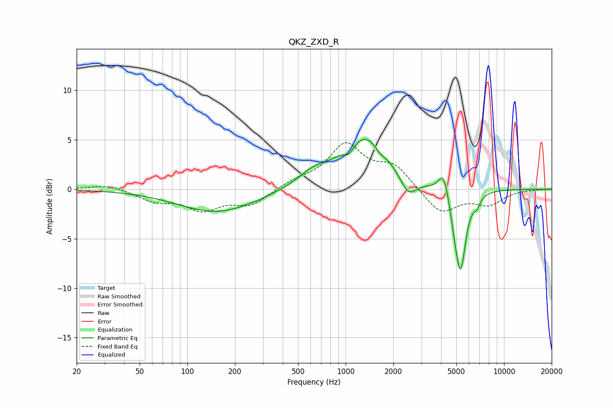

# QKZ_ZXD_R
See [usage instructions](https://github.com/jaakkopasanen/AutoEq#usage) for more options and info.

### Parametric EQs
Apply preamp of -5.1 dB when using parametric equalizer.

|   # | Type    |   Fc (Hz) |    Q |   Gain (dB) |
|-----|---------|-----------|------|-------------|
|   1 | Peaking |       155 | 0.58 |        -2.3 |
|   2 | Peaking |       624 | 1.4  |         1.2 |
|   3 | Peaking |      1049 | 4.53 |        -0.9 |
|   4 | Peaking |      1333 | 0.96 |         5.4 |
|   5 | Peaking |      1646 | 4.53 |        -0.6 |
|   6 | Peaking |      2485 | 2.65 |        -2.1 |
|   7 | Peaking |      4140 | 4.8  |         2.2 |
|   8 | Peaking |      4864 | 6    |        -1.4 |
|   9 | Peaking |      5320 | 4.24 |        -8   |
|  10 | Peaking |      6722 | 6    |        -0.9 |

### Fixed Band EQs
When using fixed band (also called graphic) equalizer, apply preamp of **-4.8 dB** (if available) and set gains manually with these parameters.

|   # | Type    |   Fc (Hz) |    Q |   Gain (dB) |
|-----|---------|-----------|------|-------------|
|   1 | Peaking |        31 | 1.41 |         0.5 |
|   2 | Peaking |        62 | 1.41 |        -1.1 |
|   3 | Peaking |       125 | 1.41 |        -1.9 |
|   4 | Peaking |       250 | 1.41 |        -1.5 |
|   5 | Peaking |       500 | 1.41 |         0.7 |
|   6 | Peaking |      1000 | 1.41 |         4.3 |
|   7 | Peaking |      2000 | 1.41 |         2.2 |
|   8 | Peaking |      4000 | 1.41 |        -2.5 |
|   9 | Peaking |      8000 | 1.41 |        -1.4 |
|  10 | Peaking |     16000 | 1.41 |        -0   |

### Graphs

