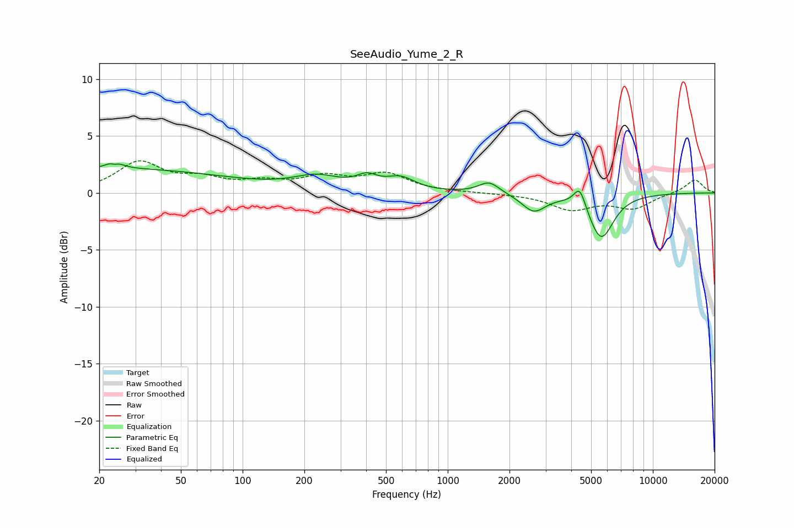

# SeeAudio_Yume_2_R
See [usage instructions](https://github.com/jaakkopasanen/AutoEq#usage) for more options and info.

### Parametric EQs
Apply preamp of -2.6 dB when using parametric equalizer.

|   # | Type    |   Fc (Hz) |    Q |   Gain (dB) |
|-----|---------|-----------|------|-------------|
|   1 | Peaking |        24 | 4.97 |         2.4 |
|   2 | Peaking |        24 | 0.24 |         2.1 |
|   3 | Peaking |        24 | 5.82 |        -2   |
|   4 | Peaking |       230 | 1.24 |         1.2 |
|   5 | Peaking |       403 | 2.77 |         1   |
|   6 | Peaking |       589 | 2.02 |         1.1 |
|   7 | Peaking |      1591 | 2.82 |         1   |
|   8 | Peaking |      2626 | 2.46 |        -1.6 |
|   9 | Peaking |      4402 | 4.88 |         1.8 |
|  10 | Peaking |      5595 | 2.31 |        -4   |

### Fixed Band EQs
When using fixed band (also called graphic) equalizer, apply preamp of **-2.9 dB** (if available) and set gains manually with these parameters.

|   # | Type    |   Fc (Hz) |    Q |   Gain (dB) |
|-----|---------|-----------|------|-------------|
|   1 | Peaking |        31 | 1.41 |         2.6 |
|   2 | Peaking |        62 | 1.41 |         1   |
|   3 | Peaking |       125 | 1.41 |         0.8 |
|   4 | Peaking |       250 | 1.41 |         1.2 |
|   5 | Peaking |       500 | 1.41 |         1.6 |
|   6 | Peaking |      1000 | 1.41 |         0   |
|   7 | Peaking |      2000 | 1.41 |        -0.1 |
|   8 | Peaking |      4000 | 1.41 |        -1.4 |
|   9 | Peaking |      8000 | 1.41 |        -1.3 |
|  10 | Peaking |     16000 | 1.41 |         1.2 |

### Graphs

