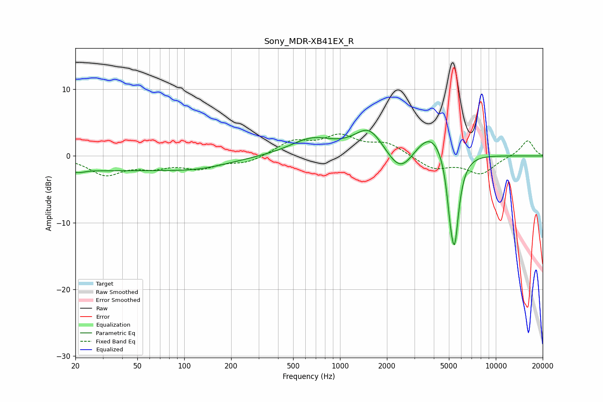

# Sony_MDR-XB41EX_R
See [usage instructions](https://github.com/jaakkopasanen/AutoEq#usage) for more options and info.

### Parametric EQs
Apply preamp of -3.9 dB when using parametric equalizer.

|   # | Type    |   Fc (Hz) |    Q |   Gain (dB) |
|-----|---------|-----------|------|-------------|
|   1 | Peaking |        20 | 5.31 |        -0.2 |
|   2 | Peaking |        22 | 4.64 |        -0.2 |
|   3 | Peaking |        26 | 0.2  |        -2.1 |
|   4 | Peaking |       128 | 0.71 |        -0.9 |
|   5 | Peaking |       660 | 1    |         2.5 |
|   6 | Peaking |      1539 | 1.5  |         4   |
|   7 | Peaking |      2448 | 1.57 |        -4.1 |
|   8 | Peaking |      3834 | 1.28 |         4.4 |
|   9 | Peaking |      5107 | 6    |        -4.2 |
|  10 | Peaking |      5444 | 4.63 |       -12.8 |

### Fixed Band EQs
When using fixed band (also called graphic) equalizer, apply preamp of **-3.4 dB** (if available) and set gains manually with these parameters.

|   # | Type    |   Fc (Hz) |    Q |   Gain (dB) |
|-----|---------|-----------|------|-------------|
|   1 | Peaking |        31 | 1.41 |        -2.7 |
|   2 | Peaking |        62 | 1.41 |        -1.4 |
|   3 | Peaking |       125 | 1.41 |        -1.6 |
|   4 | Peaking |       250 | 1.41 |        -1   |
|   5 | Peaking |       500 | 1.41 |         2.1 |
|   6 | Peaking |      1000 | 1.41 |         2.7 |
|   7 | Peaking |      2000 | 1.41 |         1.8 |
|   8 | Peaking |      4000 | 1.41 |        -1.9 |
|   9 | Peaking |      8000 | 1.41 |        -2.6 |
|  10 | Peaking |     16000 | 1.41 |         2.4 |

### Graphs

