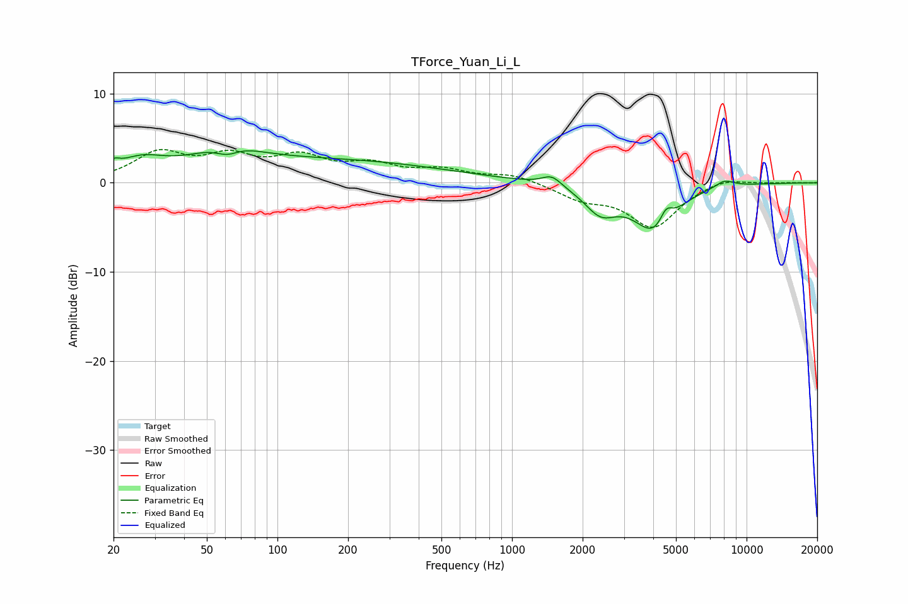

# TForce_Yuan_Li_L
See [usage instructions](https://github.com/jaakkopasanen/AutoEq#usage) for more options and info.

### Parametric EQs
Apply preamp of -3.7 dB when using parametric equalizer.

|   # | Type    |   Fc (Hz) |    Q |   Gain (dB) |
|-----|---------|-----------|------|-------------|
|   1 | Peaking |        20 | 5.8  |         0.8 |
|   2 | Peaking |        26 | 1.53 |         1.6 |
|   3 | Peaking |        61 | 2.38 |        -2   |
|   4 | Peaking |        61 | 1.41 |         2.7 |
|   5 | Peaking |       128 | 0.22 |         2.6 |
|   6 | Peaking |      1478 | 3.44 |         1.1 |
|   7 | Peaking |      2387 | 2.05 |        -2.8 |
|   8 | Peaking |      4055 | 1.57 |        -5.2 |
|   9 | Peaking |      4534 | 5.28 |         1.8 |
|  10 | Peaking |      8048 | 3.14 |         0.8 |

### Fixed Band EQs
When using fixed band (also called graphic) equalizer, apply preamp of **-3.8 dB** (if available) and set gains manually with these parameters.

|   # | Type    |   Fc (Hz) |    Q |   Gain (dB) |
|-----|---------|-----------|------|-------------|
|   1 | Peaking |        31 | 1.41 |         3.1 |
|   2 | Peaking |        62 | 1.41 |         2.5 |
|   3 | Peaking |       125 | 1.41 |         2.5 |
|   4 | Peaking |       250 | 1.41 |         1.7 |
|   5 | Peaking |       500 | 1.41 |         1.3 |
|   6 | Peaking |      1000 | 1.41 |         0.9 |
|   7 | Peaking |      2000 | 1.41 |        -1.6 |
|   8 | Peaking |      4000 | 1.41 |        -4.9 |
|   9 | Peaking |      8000 | 1.41 |         0.7 |
|  10 | Peaking |     16000 | 1.41 |         0   |

### Graphs

