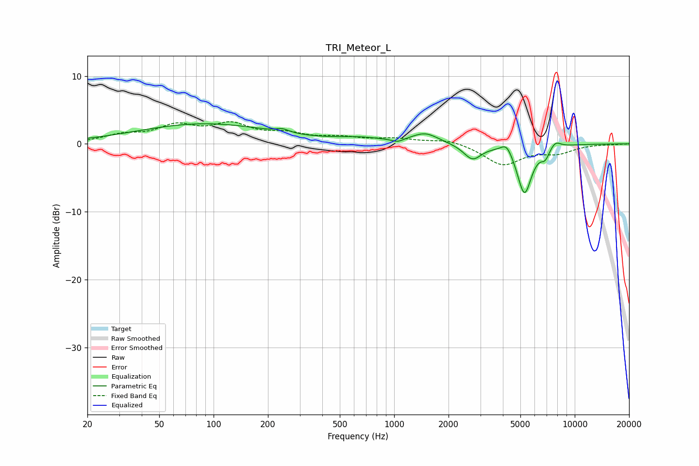

# TRI_Meteor_L
See [usage instructions](https://github.com/jaakkopasanen/AutoEq#usage) for more options and info.

### Parametric EQs
Apply preamp of -3.1 dB when using parametric equalizer.

|   # | Type    |   Fc (Hz) |    Q |   Gain (dB) |
|-----|---------|-----------|------|-------------|
|   1 | Peaking |        89 | 0.38 |         2.9 |
|   2 | Peaking |       241 | 4    |         0.5 |
|   3 | Peaking |       643 | 1.07 |         0.6 |
|   4 | Peaking |      1044 | 4.47 |        -0.5 |
|   5 | Peaking |      1485 | 1.93 |         1.5 |
|   6 | Peaking |      2716 | 2.88 |        -2.3 |
|   7 | Peaking |      4196 | 4.58 |         1.5 |
|   8 | Peaking |      5267 | 3.45 |        -7.3 |
|   9 | Peaking |      6857 | 6    |        -1.4 |
|  10 | Peaking |      7817 | 4.6  |         1   |

### Fixed Band EQs
When using fixed band (also called graphic) equalizer, apply preamp of **-3.4 dB** (if available) and set gains manually with these parameters.

|   # | Type    |   Fc (Hz) |    Q |   Gain (dB) |
|-----|---------|-----------|------|-------------|
|   1 | Peaking |        31 | 1.41 |         1.1 |
|   2 | Peaking |        62 | 1.41 |         2.4 |
|   3 | Peaking |       125 | 1.41 |         2.5 |
|   4 | Peaking |       250 | 1.41 |         1.2 |
|   5 | Peaking |       500 | 1.41 |         0.8 |
|   6 | Peaking |      1000 | 1.41 |         0.7 |
|   7 | Peaking |      2000 | 1.41 |         0.7 |
|   8 | Peaking |      4000 | 1.41 |        -3.1 |
|   9 | Peaking |      8000 | 1.41 |        -1.2 |
|  10 | Peaking |     16000 | 1.41 |        -0.1 |

### Graphs

