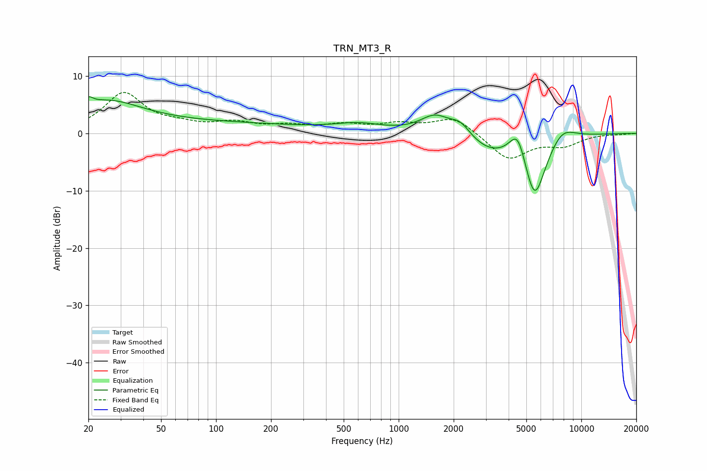

# TRN_MT3_R
See [usage instructions](https://github.com/jaakkopasanen/AutoEq#usage) for more options and info.

### Parametric EQs
Apply preamp of -6.5 dB when using parametric equalizer.

|   # | Type    |   Fc (Hz) |    Q |   Gain (dB) |
|-----|---------|-----------|------|-------------|
|   1 | Peaking |        20 | 5.87 |         1.3 |
|   2 | Peaking |        25 | 0.72 |         4.8 |
|   3 | Peaking |        96 | 0.27 |         1.7 |
|   4 | Peaking |       602 | 1.07 |         1.3 |
|   5 | Peaking |      1585 | 1.71 |         3.2 |
|   6 | Peaking |      2180 | 2.52 |         2.3 |
|   7 | Peaking |      3144 | 1.1  |        -2.7 |
|   8 | Peaking |      4487 | 3.07 |         5.5 |
|   9 | Peaking |      5546 | 2.13 |       -11.9 |
|  10 | Peaking |      7804 | 1.79 |         2.8 |

### Fixed Band EQs
When using fixed band (also called graphic) equalizer, apply preamp of **-7.2 dB** (if available) and set gains manually with these parameters.

|   # | Type    |   Fc (Hz) |    Q |   Gain (dB) |
|-----|---------|-----------|------|-------------|
|   1 | Peaking |        31 | 1.41 |         6.9 |
|   2 | Peaking |        62 | 1.41 |         1.1 |
|   3 | Peaking |       125 | 1.41 |         1.6 |
|   4 | Peaking |       250 | 1.41 |         1.1 |
|   5 | Peaking |       500 | 1.41 |         1.3 |
|   6 | Peaking |      1000 | 1.41 |         1.4 |
|   7 | Peaking |      2000 | 1.41 |         2.9 |
|   8 | Peaking |      4000 | 1.41 |        -4.6 |
|   9 | Peaking |      8000 | 1.41 |        -1.9 |
|  10 | Peaking |     16000 | 1.41 |        -0.1 |

### Graphs

