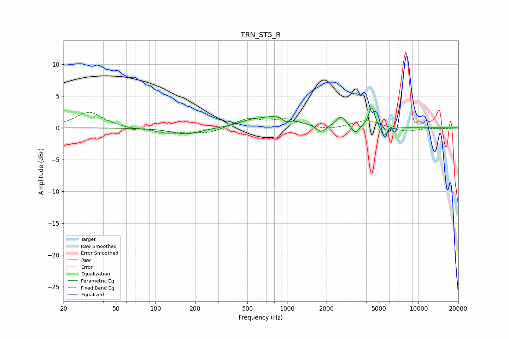

# TRN_ST5_R
See [usage instructions](https://github.com/jaakkopasanen/AutoEq#usage) for more options and info.

### Parametric EQs
Apply preamp of -3.2 dB when using parametric equalizer.

|   # | Type    |   Fc (Hz) |    Q |   Gain (dB) |
|-----|---------|-----------|------|-------------|
|   1 | Peaking |       172 | 1.26 |        -1   |
|   2 | Peaking |       525 | 1.59 |         0.6 |
|   3 | Peaking |       862 | 1.1  |         1.8 |
|   4 | Peaking |       984 | 4.23 |        -0.7 |
|   5 | Peaking |      1822 | 3.96 |        -1.2 |
|   6 | Peaking |      2565 | 4.17 |         1.2 |
|   7 | Peaking |      2603 | 2.97 |         0.5 |
|   8 | Peaking |      3310 | 5.24 |        -1.3 |
|   9 | Peaking |      4411 | 5.84 |         3.3 |
|  10 | Peaking |      5449 | 6    |        -1.6 |

### Fixed Band EQs
When using fixed band (also called graphic) equalizer, apply preamp of **-2.5 dB** (if available) and set gains manually with these parameters.

|   # | Type    |   Fc (Hz) |    Q |   Gain (dB) |
|-----|---------|-----------|------|-------------|
|   1 | Peaking |        31 | 1.41 |         2.5 |
|   2 | Peaking |        62 | 1.41 |        -0.2 |
|   3 | Peaking |       125 | 1.41 |        -0.8 |
|   4 | Peaking |       250 | 1.41 |        -0.8 |
|   5 | Peaking |       500 | 1.41 |         1.4 |
|   6 | Peaking |      1000 | 1.41 |         1.2 |
|   7 | Peaking |      2000 | 1.41 |        -0.5 |
|   8 | Peaking |      4000 | 1.41 |         1.2 |
|   9 | Peaking |      8000 | 1.41 |        -0.6 |
|  10 | Peaking |     16000 | 1.41 |        -0.1 |

### Graphs

