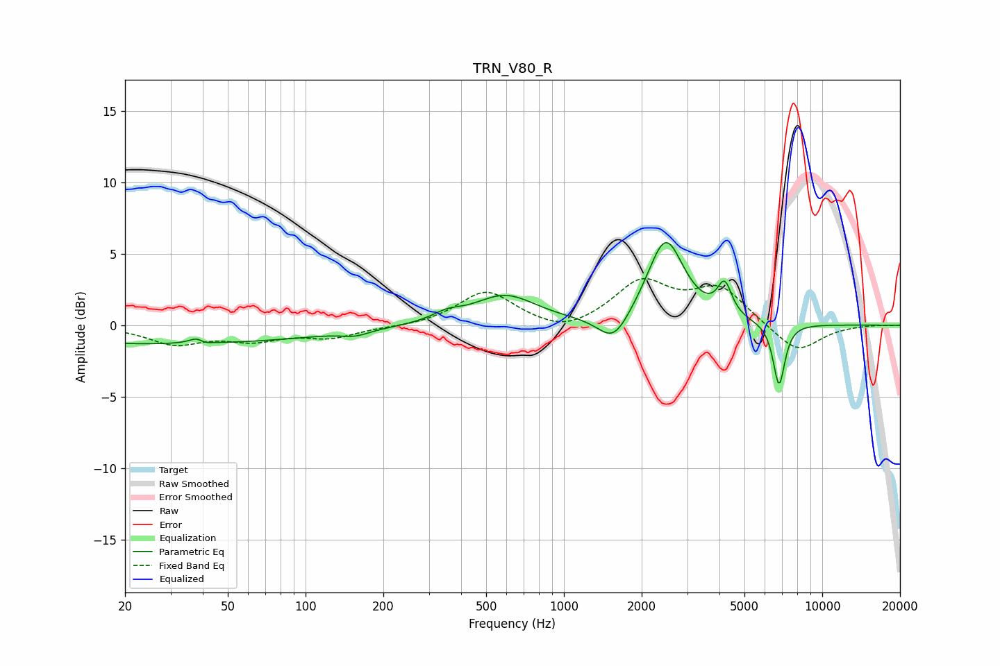

# TRN_V80_R
See [usage instructions](https://github.com/jaakkopasanen/AutoEq#usage) for more options and info.

### Parametric EQs
Apply preamp of -5.9 dB when using parametric equalizer.

|   # | Type    |   Fc (Hz) |    Q |   Gain (dB) |
|-----|---------|-----------|------|-------------|
|   1 | Peaking |        28 | 0.22 |        -1.3 |
|   2 | Peaking |        39 | 4.83 |         1.2 |
|   3 | Peaking |        40 | 5.07 |        -1   |
|   4 | Peaking |       156 | 2.7  |        -0.4 |
|   5 | Peaking |       352 | 2.49 |         0.5 |
|   6 | Peaking |       591 | 1.17 |         2.1 |
|   7 | Peaking |      1560 | 2.35 |        -2   |
|   8 | Peaking |      2476 | 2    |         6   |
|   9 | Peaking |      4190 | 5.14 |         2.2 |
|  10 | Peaking |      6804 | 6    |        -4.4 |

### Fixed Band EQs
When using fixed band (also called graphic) equalizer, apply preamp of **-3.4 dB** (if available) and set gains manually with these parameters.

|   # | Type    |   Fc (Hz) |    Q |   Gain (dB) |
|-----|---------|-----------|------|-------------|
|   1 | Peaking |        31 | 1.41 |        -1.2 |
|   2 | Peaking |        62 | 1.41 |        -0.9 |
|   3 | Peaking |       125 | 1.41 |        -0.8 |
|   4 | Peaking |       250 | 1.41 |        -0.1 |
|   5 | Peaking |       500 | 1.41 |         2.4 |
|   6 | Peaking |      1000 | 1.41 |        -0.8 |
|   7 | Peaking |      2000 | 1.41 |         2.9 |
|   8 | Peaking |      4000 | 1.41 |         2.5 |
|   9 | Peaking |      8000 | 1.41 |        -2   |
|  10 | Peaking |     16000 | 1.41 |         0   |

### Graphs

