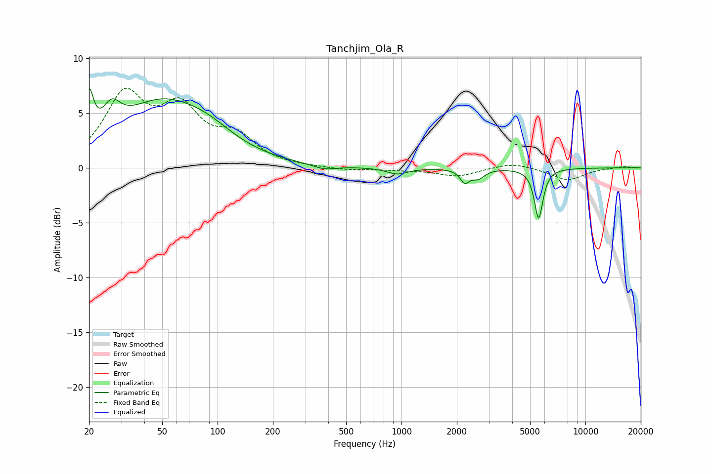

# Tanchjim_Ola_R
See [usage instructions](https://github.com/jaakkopasanen/AutoEq#usage) for more options and info.

### Parametric EQs
Apply preamp of -7.3 dB when using parametric equalizer.

|   # | Type    |   Fc (Hz) |    Q |   Gain (dB) |
|-----|---------|-----------|------|-------------|
|   1 | Peaking |        20 | 6    |         4.2 |
|   2 | Peaking |        26 | 2.93 |         2.3 |
|   3 | Peaking |        50 | 0.58 |         5.7 |
|   4 | Peaking |        89 | 1    |         1.1 |
|   5 | Peaking |       381 | 2.24 |        -0.4 |
|   6 | Peaking |       948 | 2.48 |        -0.6 |
|   7 | Peaking |      2206 | 5.77 |        -1.1 |
|   8 | Peaking |      2607 | 4.03 |        -0.8 |
|   9 | Peaking |      5543 | 5.97 |         0.6 |
|  10 | Peaking |      5565 | 6    |        -5.1 |

### Fixed Band EQs
When using fixed band (also called graphic) equalizer, apply preamp of **-7.4 dB** (if available) and set gains manually with these parameters.

|   # | Type    |   Fc (Hz) |    Q |   Gain (dB) |
|-----|---------|-----------|------|-------------|
|   1 | Peaking |        31 | 1.41 |         6.3 |
|   2 | Peaking |        62 | 1.41 |         4.7 |
|   3 | Peaking |       125 | 1.41 |         2.5 |
|   4 | Peaking |       250 | 1.41 |         0   |
|   5 | Peaking |       500 | 1.41 |        -0.2 |
|   6 | Peaking |      1000 | 1.41 |        -0.2 |
|   7 | Peaking |      2000 | 1.41 |        -0.8 |
|   8 | Peaking |      4000 | 1.41 |         0.5 |
|   9 | Peaking |      8000 | 1.41 |        -1.1 |
|  10 | Peaking |     16000 | 1.41 |         0.1 |

### Graphs

