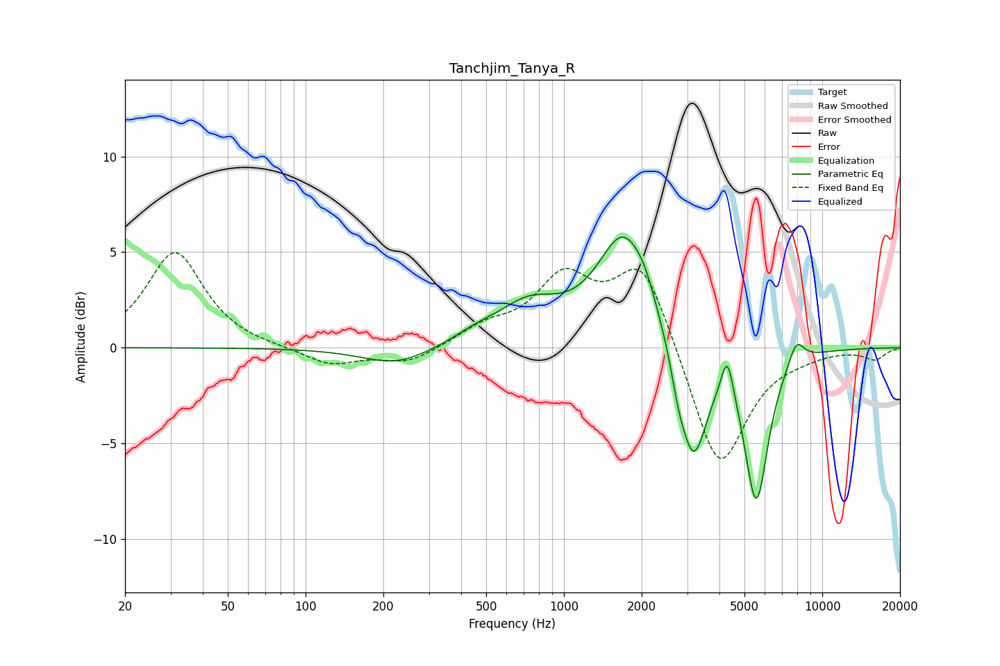

# Tanchjim_Tanya_R
See [usage instructions](https://github.com/jaakkopasanen/AutoEq#usage) for more options and info.

### Parametric EQs
Apply preamp of -5.9 dB when using parametric equalizer.

|   # | Type    |   Fc (Hz) |    Q |   Gain (dB) |
|-----|---------|-----------|------|-------------|
|   1 | Peaking |       225 | 1.07 |        -0.9 |
|   2 | Peaking |       453 | 1.7  |         0.4 |
|   3 | Peaking |       730 | 1.14 |         2   |
|   4 | Peaking |      1710 | 1.37 |         5.8 |
|   5 | Peaking |      2064 | 3.44 |         0.7 |
|   6 | Peaking |      2763 | 5.61 |        -1   |
|   7 | Peaking |      3163 | 2.55 |        -6.2 |
|   8 | Peaking |      4292 | 6    |         2.2 |
|   9 | Peaking |      5558 | 2.99 |        -7.9 |
|  10 | Peaking |      7938 | 4.35 |         1.3 |

### Fixed Band EQs
When using fixed band (also called graphic) equalizer, apply preamp of **-5.1 dB** (if available) and set gains manually with these parameters.

|   # | Type    |   Fc (Hz) |    Q |   Gain (dB) |
|-----|---------|-----------|------|-------------|
|   1 | Peaking |        31 | 1.41 |         5   |
|   2 | Peaking |        62 | 1.41 |        -0   |
|   3 | Peaking |       125 | 1.41 |        -0.9 |
|   4 | Peaking |       250 | 1.41 |        -0.8 |
|   5 | Peaking |       500 | 1.41 |         0.9 |
|   6 | Peaking |      1000 | 1.41 |         3.4 |
|   7 | Peaking |      2000 | 1.41 |         4.5 |
|   8 | Peaking |      4000 | 1.41 |        -6.6 |
|   9 | Peaking |      8000 | 1.41 |        -0.2 |
|  10 | Peaking |     16000 | 1.41 |        -0.6 |

### Graphs

