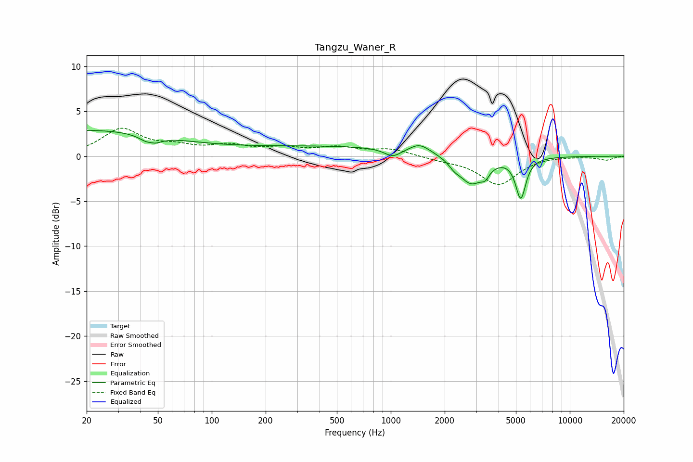

# Tangzu_Waner_R
See [usage instructions](https://github.com/jaakkopasanen/AutoEq#usage) for more options and info.

### Parametric EQs
Apply preamp of -3.0 dB when using parametric equalizer.

|   # | Type    |   Fc (Hz) |    Q |   Gain (dB) |
|-----|---------|-----------|------|-------------|
|   1 | Peaking |        20 | 0.29 |         2.9 |
|   2 | Peaking |        46 | 4.68 |         1.2 |
|   3 | Peaking |        46 | 3.54 |        -2.1 |
|   4 | Peaking |       467 | 0.25 |         1.1 |
|   5 | Peaking |      1027 | 2.98 |        -0.9 |
|   6 | Peaking |      1453 | 2.54 |         1   |
|   7 | Peaking |      2267 | 4.63 |        -0.6 |
|   8 | Peaking |      2810 | 2.08 |        -3.1 |
|   9 | Peaking |      3368 | 5.96 |        -0.9 |
|  10 | Peaking |      5322 | 4.98 |        -4.5 |

### Fixed Band EQs
When using fixed band (also called graphic) equalizer, apply preamp of **-3.2 dB** (if available) and set gains manually with these parameters.

|   # | Type    |   Fc (Hz) |    Q |   Gain (dB) |
|-----|---------|-----------|------|-------------|
|   1 | Peaking |        31 | 1.41 |         2.9 |
|   2 | Peaking |        62 | 1.41 |         0.9 |
|   3 | Peaking |       125 | 1.41 |         1   |
|   4 | Peaking |       250 | 1.41 |         0.7 |
|   5 | Peaking |       500 | 1.41 |         0.9 |
|   6 | Peaking |      1000 | 1.41 |         0.8 |
|   7 | Peaking |      2000 | 1.41 |        -0.3 |
|   8 | Peaking |      4000 | 1.41 |        -3.1 |
|   9 | Peaking |      8000 | 1.41 |         0.1 |
|  10 | Peaking |     16000 | 1.41 |        -0.4 |

### Graphs

