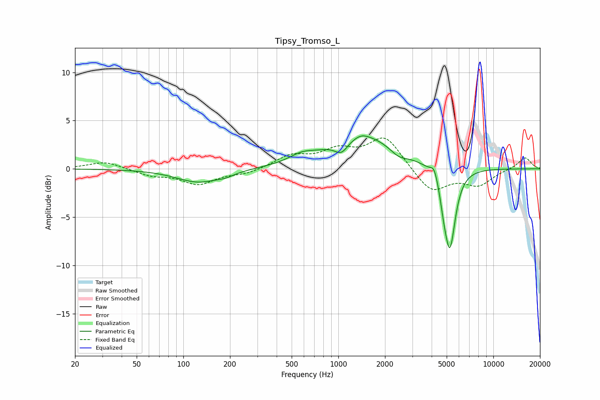

# Tipsy_Tromso_L
See [usage instructions](https://github.com/jaakkopasanen/AutoEq#usage) for more options and info.

### Parametric EQs
Apply preamp of -3.5 dB when using parametric equalizer.

|   # | Type    |   Fc (Hz) |    Q |   Gain (dB) |
|-----|---------|-----------|------|-------------|
|   1 | Peaking |       125 | 0.99 |        -1.4 |
|   2 | Peaking |       188 | 2.61 |        -0.3 |
|   3 | Peaking |       581 | 1.71 |         0.7 |
|   4 | Peaking |      1047 | 3.27 |        -1.2 |
|   5 | Peaking |      1411 | 3.26 |         0.3 |
|   6 | Peaking |      1449 | 0.66 |         3.4 |
|   7 | Peaking |      2452 | 2.57 |        -0.7 |
|   8 | Peaking |      4159 | 6    |         1.2 |
|   9 | Peaking |      4776 | 6    |        -1.3 |
|  10 | Peaking |      5240 | 3.86 |        -8.3 |

### Fixed Band EQs
When using fixed band (also called graphic) equalizer, apply preamp of **-3.3 dB** (if available) and set gains manually with these parameters.

|   # | Type    |   Fc (Hz) |    Q |   Gain (dB) |
|-----|---------|-----------|------|-------------|
|   1 | Peaking |        31 | 1.41 |         0.8 |
|   2 | Peaking |        62 | 1.41 |        -0.6 |
|   3 | Peaking |       125 | 1.41 |        -1.5 |
|   4 | Peaking |       250 | 1.41 |        -0.5 |
|   5 | Peaking |       500 | 1.41 |         1.3 |
|   6 | Peaking |      1000 | 1.41 |         1.7 |
|   7 | Peaking |      2000 | 1.41 |         3.3 |
|   8 | Peaking |      4000 | 1.41 |        -2.5 |
|   9 | Peaking |      8000 | 1.41 |        -1.6 |
|  10 | Peaking |     16000 | 1.41 |         1.2 |

### Graphs

