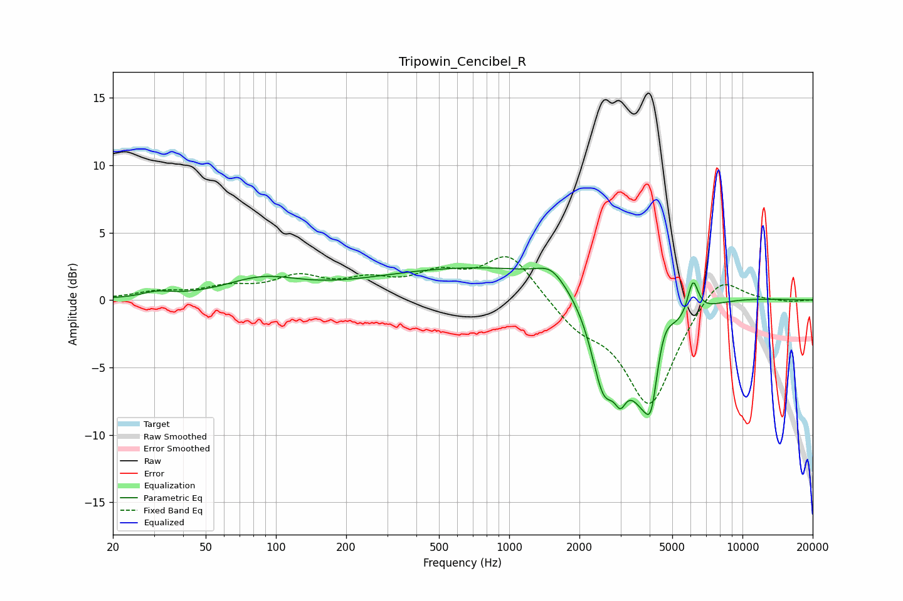

# Tripowin_Cencibel_R
See [usage instructions](https://github.com/jaakkopasanen/AutoEq#usage) for more options and info.

### Parametric EQs
Apply preamp of -2.5 dB when using parametric equalizer.

|   # | Type    |   Fc (Hz) |    Q |   Gain (dB) |
|-----|---------|-----------|------|-------------|
|   1 | Peaking |        31 | 2.33 |         0.4 |
|   2 | Peaking |        87 | 0.9  |         1.4 |
|   3 | Peaking |      1277 | 0.18 |         2.7 |
|   4 | Peaking |      1513 | 2.36 |         1.1 |
|   5 | Peaking |      2532 | 2.69 |        -5.7 |
|   6 | Peaking |      2998 | 5.81 |        -1.9 |
|   7 | Peaking |      3937 | 1.41 |       -10.3 |
|   8 | Peaking |      4073 | 5.99 |        -2.3 |
|   9 | Peaking |      4549 | 2.84 |         4.4 |
|  10 | Peaking |      6134 | 6    |         2.7 |

### Fixed Band EQs
When using fixed band (also called graphic) equalizer, apply preamp of **-3.3 dB** (if available) and set gains manually with these parameters.

|   # | Type    |   Fc (Hz) |    Q |   Gain (dB) |
|-----|---------|-----------|------|-------------|
|   1 | Peaking |        31 | 1.41 |         0.5 |
|   2 | Peaking |        62 | 1.41 |         0.8 |
|   3 | Peaking |       125 | 1.41 |         1.5 |
|   4 | Peaking |       250 | 1.41 |         1.2 |
|   5 | Peaking |       500 | 1.41 |         1.6 |
|   6 | Peaking |      1000 | 1.41 |         3.4 |
|   7 | Peaking |      2000 | 1.41 |        -1.7 |
|   8 | Peaking |      4000 | 1.41 |        -7.8 |
|   9 | Peaking |      8000 | 1.41 |         2.3 |
|  10 | Peaking |     16000 | 1.41 |        -0.1 |

### Graphs

