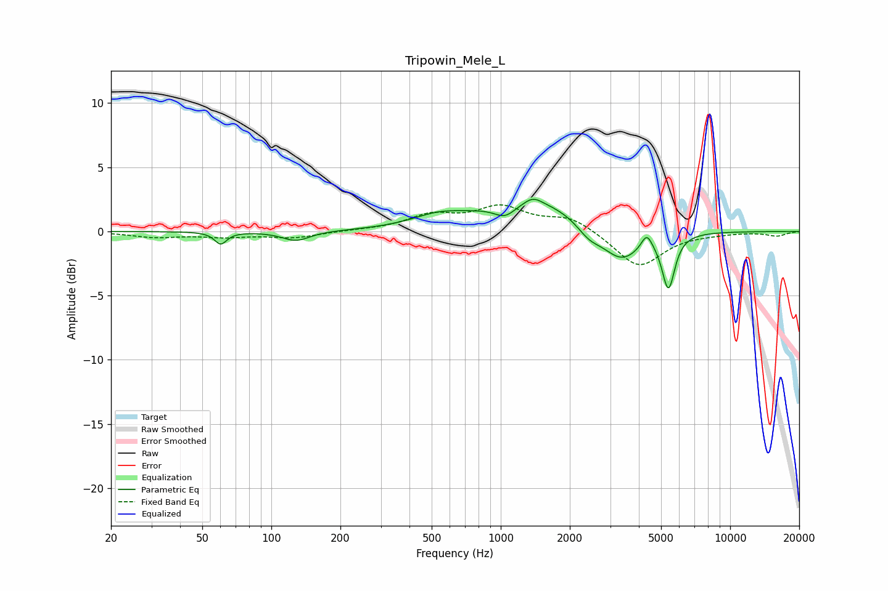

# Tripowin_Mele_L
See [usage instructions](https://github.com/jaakkopasanen/AutoEq#usage) for more options and info.

### Parametric EQs
Apply preamp of -2.6 dB when using parametric equalizer.

|   # | Type    |   Fc (Hz) |    Q |   Gain (dB) |
|-----|---------|-----------|------|-------------|
|   1 | Peaking |        60 | 5.44 |        -0.9 |
|   2 | Peaking |       128 | 2.34 |        -0.8 |
|   3 | Peaking |       534 | 1.23 |         0.8 |
|   4 | Peaking |      1045 | 2.87 |        -1   |
|   5 | Peaking |      1384 | 3.89 |         0.5 |
|   6 | Peaking |      1398 | 0.66 |         2.5 |
|   7 | Peaking |      2422 | 2.62 |        -1   |
|   8 | Peaking |      3351 | 1.62 |        -2.6 |
|   9 | Peaking |      4331 | 6    |         1.2 |
|  10 | Peaking |      5382 | 5.08 |        -4.2 |

### Fixed Band EQs
When using fixed band (also called graphic) equalizer, apply preamp of **-2.2 dB** (if available) and set gains manually with these parameters.

|   # | Type    |   Fc (Hz) |    Q |   Gain (dB) |
|-----|---------|-----------|------|-------------|
|   1 | Peaking |        31 | 1.41 |        -0.4 |
|   2 | Peaking |        62 | 1.41 |        -0.4 |
|   3 | Peaking |       125 | 1.41 |        -0.5 |
|   4 | Peaking |       250 | 1.41 |         0.1 |
|   5 | Peaking |       500 | 1.41 |         1.2 |
|   6 | Peaking |      1000 | 1.41 |         1.8 |
|   7 | Peaking |      2000 | 1.41 |         1.1 |
|   8 | Peaking |      4000 | 1.41 |        -2.8 |
|   9 | Peaking |      8000 | 1.41 |        -0.1 |
|  10 | Peaking |     16000 | 1.41 |        -0.3 |

### Graphs

