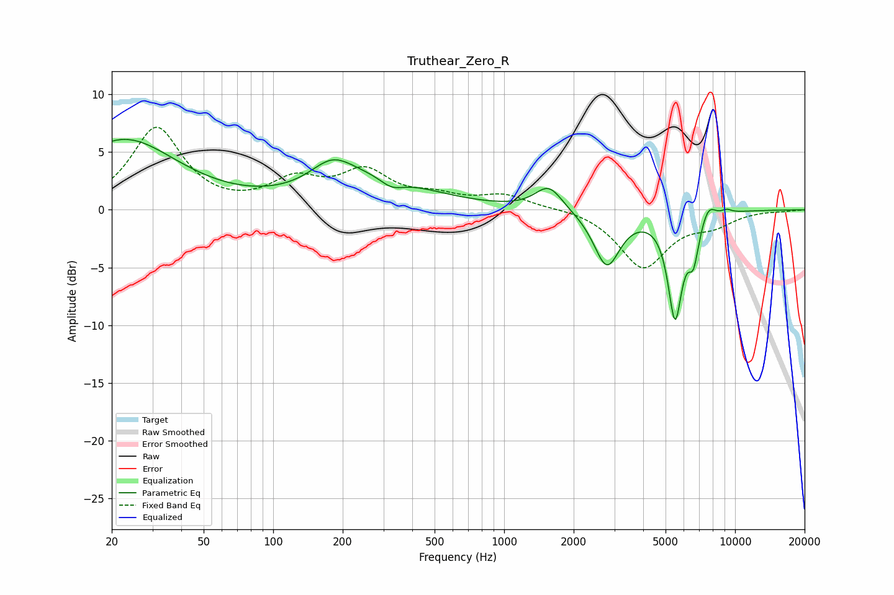

# Truthear_Zero_R
See [usage instructions](https://github.com/jaakkopasanen/AutoEq#usage) for more options and info.

### Parametric EQs
Apply preamp of -6.2 dB when using parametric equalizer.

|   # | Type    |   Fc (Hz) |    Q |   Gain (dB) |
|-----|---------|-----------|------|-------------|
|   1 | Peaking |        23 | 0.61 |         6   |
|   2 | Peaking |       180 | 1.54 |         2.1 |
|   3 | Peaking |       273 | 0.59 |         2.5 |
|   4 | Peaking |       326 | 2.67 |        -0.9 |
|   5 | Peaking |      1562 | 2.41 |         2.1 |
|   6 | Peaking |      2784 | 2.5  |        -4.8 |
|   7 | Peaking |      5498 | 4.43 |        -8.9 |
|   8 | Peaking |      6603 | 5.96 |        -3.2 |
|   9 | Peaking |      7670 | 4.53 |         1.2 |
|  10 | Peaking |      9202 | 5.99 |         0.3 |

### Fixed Band EQs
When using fixed band (also called graphic) equalizer, apply preamp of **-7.2 dB** (if available) and set gains manually with these parameters.

|   # | Type    |   Fc (Hz) |    Q |   Gain (dB) |
|-----|---------|-----------|------|-------------|
|   1 | Peaking |        31 | 1.41 |         7   |
|   2 | Peaking |        62 | 1.41 |        -0.1 |
|   3 | Peaking |       125 | 1.41 |         2.3 |
|   4 | Peaking |       250 | 1.41 |         3   |
|   5 | Peaking |       500 | 1.41 |         0.9 |
|   6 | Peaking |      1000 | 1.41 |         1.2 |
|   7 | Peaking |      2000 | 1.41 |         0.2 |
|   8 | Peaking |      4000 | 1.41 |        -5   |
|   9 | Peaking |      8000 | 1.41 |        -1.1 |
|  10 | Peaking |     16000 | 1.41 |        -0.1 |

### Graphs

