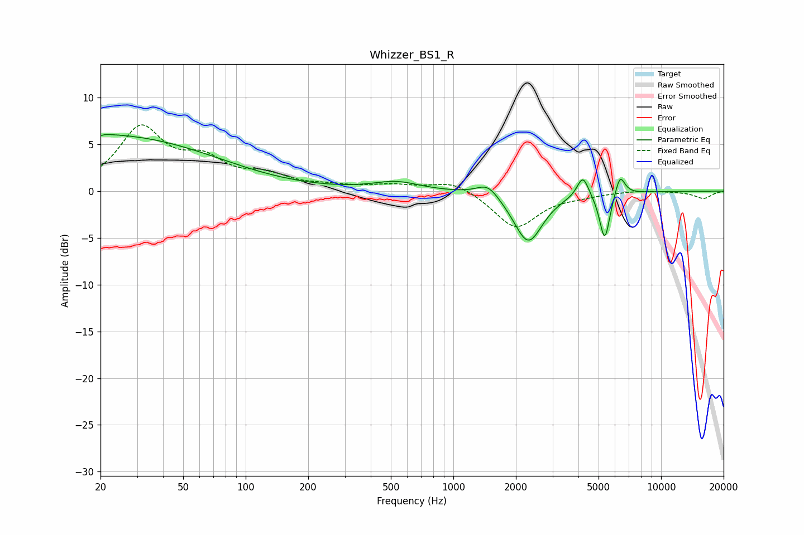

# Whizzer_BS1_R
See [usage instructions](https://github.com/jaakkopasanen/AutoEq#usage) for more options and info.

### Parametric EQs
Apply preamp of -6.2 dB when using parametric equalizer.

|   # | Type    |   Fc (Hz) |    Q |   Gain (dB) |
|-----|---------|-----------|------|-------------|
|   1 | Peaking |        20 | 6    |        -3.4 |
|   2 | Peaking |        20 | 5.82 |         3.3 |
|   3 | Peaking |        20 | 0.25 |         6   |
|   4 | Peaking |        60 | 0.81 |         0   |
|   5 | Peaking |       531 | 1.29 |         0.9 |
|   6 | Peaking |      1466 | 2.65 |         1.4 |
|   7 | Peaking |      2292 | 2.03 |        -5.5 |
|   8 | Peaking |      4204 | 5.03 |         2.3 |
|   9 | Peaking |      5353 | 5.61 |        -5.2 |
|  10 | Peaking |      6342 | 5.85 |         2.3 |

### Fixed Band EQs
When using fixed band (also called graphic) equalizer, apply preamp of **-7.2 dB** (if available) and set gains manually with these parameters.

|   # | Type    |   Fc (Hz) |    Q |   Gain (dB) |
|-----|---------|-----------|------|-------------|
|   1 | Peaking |        31 | 1.41 |         6.5 |
|   2 | Peaking |        62 | 1.41 |         2.8 |
|   3 | Peaking |       125 | 1.41 |         1.4 |
|   4 | Peaking |       250 | 1.41 |         0.4 |
|   5 | Peaking |       500 | 1.41 |         0.6 |
|   6 | Peaking |      1000 | 1.41 |         1.2 |
|   7 | Peaking |      2000 | 1.41 |        -4   |
|   8 | Peaking |      4000 | 1.41 |        -0.3 |
|   9 | Peaking |      8000 | 1.41 |         0.1 |
|  10 | Peaking |     16000 | 1.41 |        -0.8 |

### Graphs

