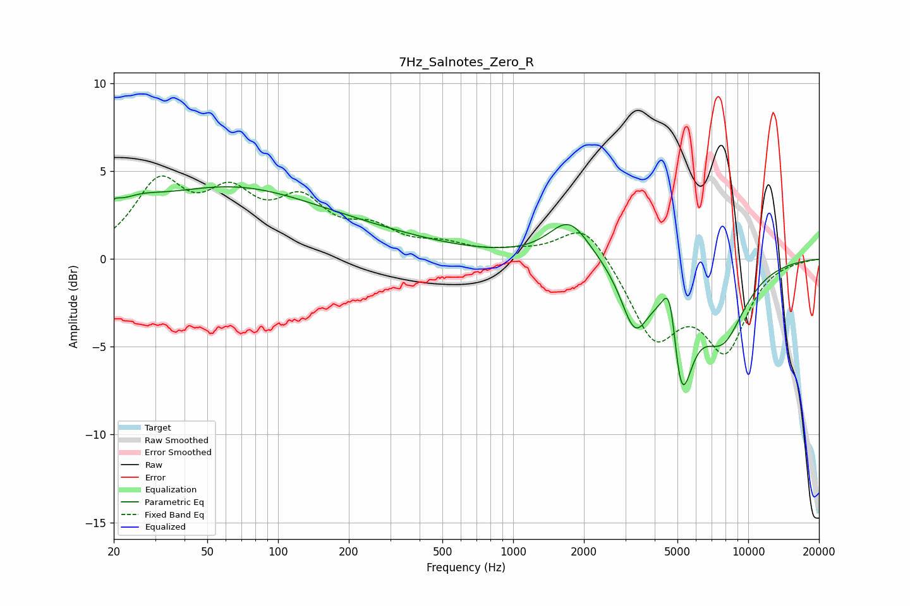

# 7Hz_Salnotes_Zero_R
See [usage instructions](https://github.com/jaakkopasanen/AutoEq#usage) for more options and info.

### Parametric EQs
Apply preamp of -4.2 dB when using parametric equalizer.

|   # | Type    |   Fc (Hz) |    Q |   Gain (dB) |
|-----|---------|-----------|------|-------------|
|   1 | Peaking |        20 | 5.42 |         0.5 |
|   2 | Peaking |        23 | 1.19 |         0.7 |
|   3 | Peaking |        25 | 1.31 |         0.5 |
|   4 | Peaking |        62 | 0.43 |         2.1 |
|   5 | Peaking |        88 | 0.21 |         1.9 |
|   6 | Peaking |      1734 | 1.65 |         2.3 |
|   7 | Peaking |      3289 | 2.43 |        -3.4 |
|   8 | Peaking |      4673 | 4.19 |         4.3 |
|   9 | Peaking |      5137 | 2.87 |        -7.4 |
|  10 | Peaking |      7760 | 1.34 |        -4.1 |

### Fixed Band EQs
When using fixed band (also called graphic) equalizer, apply preamp of **-4.8 dB** (if available) and set gains manually with these parameters.

|   # | Type    |   Fc (Hz) |    Q |   Gain (dB) |
|-----|---------|-----------|------|-------------|
|   1 | Peaking |        31 | 1.41 |         4   |
|   2 | Peaking |        62 | 1.41 |         3   |
|   3 | Peaking |       125 | 1.41 |         2.8 |
|   4 | Peaking |       250 | 1.41 |         1.4 |
|   5 | Peaking |       500 | 1.41 |         0.7 |
|   6 | Peaking |      1000 | 1.41 |         0.3 |
|   7 | Peaking |      2000 | 1.41 |         2.2 |
|   8 | Peaking |      4000 | 1.41 |        -4.4 |
|   9 | Peaking |      8000 | 1.41 |        -4.8 |
|  10 | Peaking |     16000 | 1.41 |        -0   |

### Graphs

